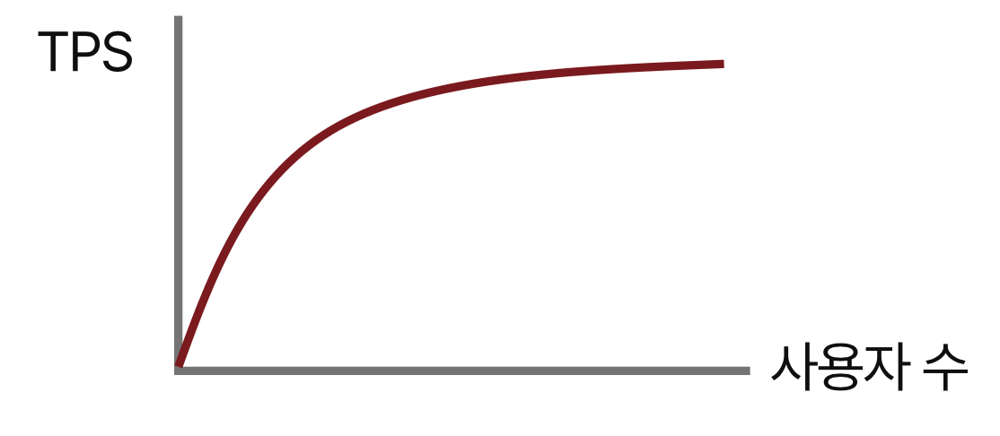
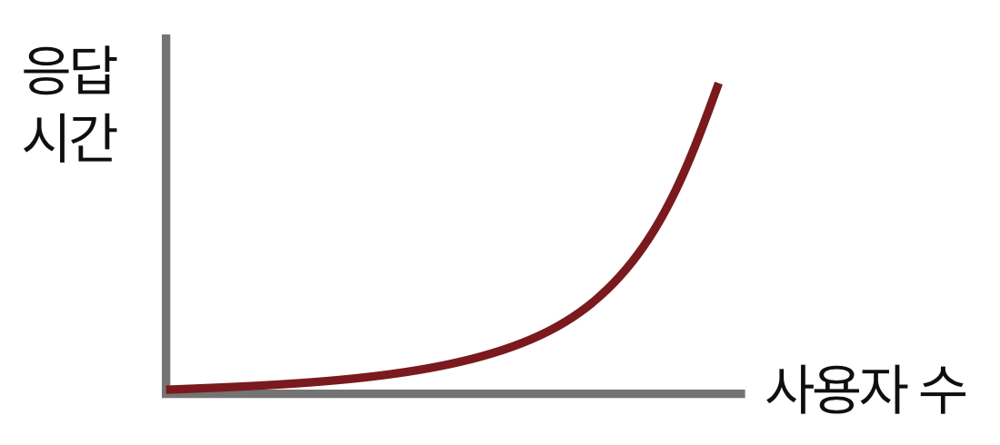
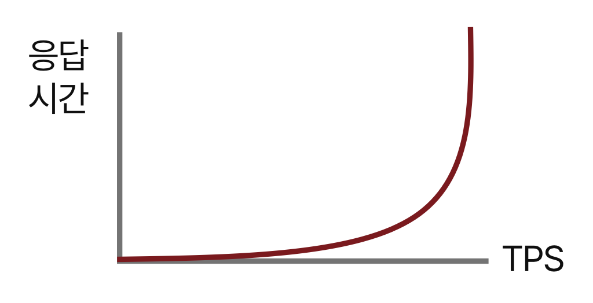

# 1. 성능과 측정 도구
정리할 내용은 아래와 같습니다.

**1.1. 성능**
- 1.1.1. 성능의 주요 지표
- 1.1.2. 지표 간 상관관계
- 1.1.3. 성능의 병목 지점

**1.2. 성능 측정 도구**
- 1.2.1. 모니터링 도구
- 1.2.2. 성능 분석 도구
- 1.2.3. 성능 테스트 도구

**1.3. 성능 테스트**
- 1.3.1. 성능 테스트의 목적 및 범위
- 1.3.2. 성능 테스트 용어
- 1.3.3. 서비스 별 특성

Appendix
- 스터디에 적합한 도구 고민

---

## 1.1. 성능
> [!IMPORTANT]
> - `1.1.1 성능의 주요 지표` 및 `1.3.3. 서비스 별 특성`에서 후술하겠지만, 성능을 구성하는 지표는 다양하고 서비스의 특성에 따라 각 지표의 중요도가 달라짐
> - 따라서 성능을 측정할 때는 서비스의 특성을 고려하여 적절한 지표를 선택하고, 이를 기반으로 성능 개선에 접근해야 함

> [!TIP]
> [성능은 왜 중요할까?](https://github.com/ruthetum/study/tree/main/java/performance)

 

### 1.1.1. 성능의 주요 지표
| 지표 |                설명                |
|:---:|:--------------------------------:|
| 사용자(Users) |     서비스를 사용(부하를 생성)하는 사용자의 수     |
| 응답 시간(Response Time) | 각 요청에 대한 응답시간 (= 요청 시간 + 응답 시간)  |
| 초당 처리량(TPS) |        초당 처리 가능한 트랜잭션의 수         |
| 리소스 사용량(Resource Usage) | CPU, 메모리, 네트워크 등 부하 발생 시 리소스 사용량 |

#### 사용자
- 활성 사용자(서비스에 요청을 하고 응답을 받는 사용자)와 서비스 접속 사용자(서비비스에 접속하고 있는 사용자, 동시 접속 사용자)로 나누어서 생각해볼 수 있음
- 활성 사용자는 직접적으로 서비스에 부하를 사용자로 VU와 동일
- 서비스 접속 사용자는 활성 사용자를 포함한 개념으로 서비스에 직접적인 부하를 주거나, 추가적인 부하를 발생시킬 수 있음

#### 응답 시간
- 시스템 관점의 응답 시간으로, 요청 시간(Request Time)과 응답 시간(Response Time)으로 분리 가능
- 응답 시간이 지연됐다는 결과가 단순히 서버 애플리케이션의 병목이 아닐 수 있음 (e.g. 클라이언트와의 네트워크 지연, 비효율적인 데이터 포맷 등)

#### 초당 처리량(TPS)
- 초당 처리 가능한 트랜잭션의 수, 얼마나 많은 요청을 처리할 수 있는지를 나타내는 지표
- 단일 API 별로 측정할 수도 있지만, 기능(화면) 별로 TPS를 측정하는 것도 어느 정도 의미가 있음

추가로 [Optimizing Java](https://product.kyobobook.co.kr/detail/S000001810148)에서 설명하는 세분화된 성능 지표는 아래와 같음

* 처리율: `초당 처리량`
* 지연: `응답 시간`
* 용량(capacity): `초당 처리량`이 일정 시간동안 처리 가능한 수라면, 용량은 동시 처리 가능한 작업단위의 수(총량)
* 사용률: `리소스 사용량`
* 효율(Efficiency): `처리율` / `용량`
* 확장성(Scalability): `리소스 사용량` 증가에 따른 `처리율` 증가 정도 (선형적인지, 비선형적인지)
* 저하(Degradation): 부하가 증가했을 때 `초당 처리량` 또는 `응답 시간`이 변하는 정도

용량, 효율, 확장성, 저하는 위에서 정리한 주요 지표를 바탕으로 연산 또는 파생되는 지표

 

### 1.1.2. 지표 간 상관관계

> [!IMPORTANT]
> TPS가 최대치에 도달하는 이유
> - 병목지점이 존재하기 때문
> - 따라서 병목지점을 파악하고 개선하는 것이 중요

#### TPS와 Time 간의 관계
- TPS는 Scale out/up을 통해 증가시킬 수 있음
- Time은 Scale out/up을 통해 개선할 수 없음
- 둘 다 튜닝을 통해 개선할 수 있음

#### TPS와 사용자 수 간의 관계

- User가 증가함에 따라 TPS는 어느 정도로 증가하다가, TPS 최대치에 도달하면 더 이상 증가하지 않음

#### 사용자 수와 응답시간 간의 관계

- User가 증가해도 응답 시간은 초기에 일정한 속도를 유지
- TPS가 최대치에 도달한 이후 응답 시간이 급격히 증가

#### TPS와 응답시간 간의 관계

- TPS가 증가해도 응답속도는 증가하지 않음
- TPS가 최대치에 근접하면 응답속도가 급격히 증가

 

### 1.1.3. 성능의 병목 지점
> [병목(Bottleneck)](https://ko.wikipedia.org/wiki/%EB%B3%91%EB%AA%A9): 전체 시스템의 성능이나 용량이 하나의 구성 요소로 인해 제한을 받는 현상

- DB
- 서버 (OS 및 리소스)
- 네트워크
- 데이터 포맷
- 서드 파티 및 연계 서버
- Client

서비스의 사용자가 증가하고, 데이터의 크기가 커지면 필연적으로 병목이 발생할 수 밖에 없음

따라서 병목 발생 시 이를 파악하고, 개선하는 것이 중요

#### DB
대부분의 애플리케이션은 DB에 의존하여 서비스를 제공하기 때문에 다양한 문제가 발생할 수 있음

|             문제             |                       대응 방안                        |
|:--------------------------:|:--------------------------------------------------:|
|      비효율적인 DB 커넥션 관리       |      Connection Pool을 통한 재사용 (e.g. Hikari CP)      |
|        **비효율적인 쿼리**        |                 index 설정 및 실행계획 확인                 |
| **무분별한 쿼리** (e.g. ORM N+1) |       Fetch Join, EntityGraph, Batch size 설정       |
|       모든 기능을 DB로 해결        | 기능에 적합한 데이터베이스를 함께 사용 (e.g. 캐시, 분산 클러스터 컴퓨팅, 검색엔진) |

#### 서버
|      문제       |                                                     대응 방안                                                      |
|:-------------:|:--------------------------------------------------------------------------------------------------------------:|
|     OS 설정     |                                         OS 설정을 서비스 특성에 맞게 추가 설정(튜닝) 필요                                         |
|  CPU 리소스 부족   |                                     요청량, 응답 속도 등을 확인하여 튜닝한 후, Scale Out/Up                                     |
| Memory 리소스 부족 | 일반적으로 메모리 병목은 크게 발생하지 않음 (JVM 시작 시 최대 메모리 사용량을 할당) 다만 서비스 특성(e.g. 용량이 큰 데이터를 한번에 처리해야 하는 작업)에 따라 조절할 필요는 있음 |

> [!TIP]
> Scale Out vs Scale Up
> - 무조건 Scale Out이 좋은 것은 아님. 서비스의 특성에 따라 장비 증가 시 네트워크 부하, 데이터 전달을 위한 오버헤드 등 추가적인 병목이 발생할 수 있음
> - 따라서 서비스의 특성에 맞게 Scale Out/Up을 선택해야 함

> [!TIP]
> Java 기반 Memory 및 GC 관련 설정
> - Memory: Java 기반에서 메모리를 무조건 늘린다고 해서 성능이 좋아지는 것은 아님 (GC 발생 시 시간이 더 걸릴 수 있음)

> [!TIP]
> GC 관련 설정
> - 과거에는 GC 튜닝을 진행했지만, Java 9 이후부터는 G1GC 가 기본으로 설정되어 있어 별도 설정을 하지 않음
> - 다만 `Container` 환경에서 사용 시 CPU 2core 이상, Memory 2GB 이상이어야 G1GC가 채택되고, 그보다 낮은 경우 SerialGC가 채택됨

#### 네트워크
- IDC와 클라우드 환경에서 접근/제한할 수 있는 레이어는 다르지만, 각 레이어에서 따라 스위치 장비들이 활용
- 그리고 그 구성에 따라 네트워크의 대역폭(bandwidth)이 결정됨
- 사용 가능한 대역폭을 넘어가는 요청이 발생하면 패킷이 손실되거나 지연이 발생할 수 있음

#### 데이터 포맷
- 데이터 포맷이 비효율적일 경우, 데이터 전송 시간이 길어질 수 있음
- 혹은 데이터 압축 및 암호화 방식이 비효율적일 경우, 데이터 처리 시간이 길어질 수 있음

#### 서드 파티 및 연계 서버
- 외부 연계 서버로 인해 병목이 발생할 수 있음
- 외부 서버 통신 시 전체 서비스의 성능 저하를 방지하기 위해 Timeout 설정 필요

#### Client
- Client side에서 API를 비정상적으로 과다하게 호출하는 경우, 서버에 부하를 주어 성능 저하를 유발할 수 있음
- 따라서 Client side의 요청량을 모니터링하고, 비정상적인 요청이 발생하지 않게 client side의 로직을 수정할 필요도 있음

  

## 1.2. 성능 측정 도구
성능 측정 도구는 크게 아래 세 가지로 분류할 수 있음
- 모니터링 도구
- 성능 분석 도구
- 성능 테스트 도구

굳이 나누자면 이렇게 나누지만, APM의 경우 모니터링 도구의 기능도 함께 제공하는 경우가 많음

 

### 1.2.1. 모니터링 도구
> 서버 리소스, 커스텀 메트릭 모니터링 도구

서버 리소스 또는 서비스의 메트릭을 모니터링하는 도구
- 서버의 CPU, Memory, Disk, Network 등의 리소스 사용량을 확인할 수 있음
- **Grafana**, **Prometheus** 등

 

### 1.2.2. 성능 분석 도구
> Profiler, APM

Profiler
- 운영이 아닌 개발 단계에서 활용하는 도구로, CPU, Memory, Thread 등을 분석할 때 사용
- **VisualVM**, JProfiler 등
  
APM
- 운영 환경에서 서비스의 성능을 모니터링하고 분석하는 도구
- Datadog, New Relic, **Pinpoint**, **Scouter** 등

 

### 1.2.3. 성능 테스트 도구
> Benchmark 테스트 도구, 성능(부하) 테스트 도구

Benchmark 테스트 도구
- 특정 기능을 기준으로 두 개 이상의 대상에 대한 성능을 비교하기 위한 도구
- **JMH** 등

> [!TIP]
> [JMH(Java Microbenchmark Harness)](https://github.com/openjdk/jmh)
> - Java 기반의 벤치마크 테스트 도구
> - 관련 내용 및 예제 코드가 궁금하신 분은 `playground/ruthetum/practice/benchmark/`를 확인해주세요!

성능(부하) 테스트 도구
- 서비스의 성능을 측정하기 위한 도구
- **k6**, **nGrinder**, **Locust**, **JMeter**, **Gatling** 등

  

## 1.3. 성능 테스트

### 1.3.1. 성능 테스트의 목적 및 범위
#### 목적
- 인프라 용량 산정
  - 설정한 리소스를 통해 얼마나 많은 사용자/요청을 처리할 수 있는지 확인
  - 확장 시 얼마나 많은 리소스가 필요한지 확인
- 결함 발견
  - 부하 상황을 사전에 점검하여 성능에 문제가 없는지 확인

#### 테스트 대상 (서비스 기준)
- 성능이 중요한 서비스
  - 소수의 회사 사람이 사용하는 백오피스 서비스는 테스트 대비 시간/비용 효율이 떨어질 수 있음
  - 대규모 및 불특정 다수를 대상으로 하는 서비스에 대해 테스트를 진행하는 것이 좋음
- 순간적인 부하가 발생하는 서비스
  - 선착순 서비스와 같이 특정 순간 요청이 집중되는 서비스에 대해 테스트를 진행하는 것이 좋음

#### 테스트 대상 (API 기준)
- API를 기준으로는 요청량이 많거나 사용자 접속이 많은 화면에서 호출되는 API를 기준으로 진행
  - ref. 파레토 법칙 (80:20 법칙, 20%의 사람들이 80%의 부를 소유 = 많이 접근하는 소수의 화면이 API의 대다수 요청을 처리함)
- 모든 API를 대상으로 진행하는 것은 비효율적일 수 있음

 

### 1.3.2. 성능 테스트 용어
> [!TIP]
> [부하 테스트의 종류](https://grafana.com/docs/k6/latest/testing-guides/test-types/)

#### 도구 및 설정
|             용어              |                             설명                             |
|:---------------------------:|:----------------------------------------------------------:|
|      VU(Virtual User)       |                  가상 사용자, 서비스에 요청을 보내는 사용자                  |
| Agent (or Load Generator)   | 부하 발생기 (잘못된 설정으로 인해 정상 동작하지 않는 경우 테스트 결과가 정확하지 않을 수 있음) |

#### 지표 관련
|                 용어                 |                                             설명                                         |
|:----------------------------------:|:--------------------------------------------------------------------------------------:|
|    TPS(Transaction Per Second)     |                                     초당 처리 가능한 트랜잭션의 수                                  |
|      RPS(Request Per Second)       |                                      초당 처리 가능한 요청의 수                                   |
|     Response Time / Think Time     |                            각 요청에 대한 응답 시간 / 응답 후 다음 요청까지의 대기 시간                        |
| Average / Median / P90 / P95 / P99 | 평균 / 중앙값 / 상위 90% 지점 / 상위 95% 지점 / 상위 99% 지점 |

 

### 1.3.3. 서비스 별 특성
서비스마다 어떤 기능을 제공하는지에 따라 리소스를 사용하는 특성이 달라짐
- 어떤 리소스에 영향이 큰지 파악 필요
- 어떤 서버 컴포넌트가 부하가 제일 많이 갈 것인지 파악 필요

> **리소스 종류**: CPU/GPU, Memory, Network, Disk ...
> 
> **서버 컴포넌트 종류**: Application Server, DB/Cache Server, File Server, Network ...

| 리소스 |                 기능 및 서비                 |
|:---:|:---------------------------------------:|
| CPU |  대부분의 서비스가 많이 사용, 계산 작업, 암호화, 압축, 해싱 등  |
| GPU |            그래픽 작업, AI 기반 서비스            |
| Memory |  빠른 응답을 위한 서비스, 대용량 데이터를 한 번에 처리하는 서비스  |
| Network | 스트리밍 서비스, 파일 제공 서비스 (정확히 대역폭을 많이 활용) |
| Disk |                파일 저장 서비스                |

  

## Appendix
### 스터디에 적합한 도구 고민

기준
- 비용? (무조건 무료)
- 테스트 요구사항을 잘 처리할 수 있는가 (측정 지표 수집)
- 사용성이 좋은가 (편한 설정 및 사용법)
- 확장성이 좋은가 (다양한 시나리오)
- 결과에 대한 가독성이 좋은가

_TBU_