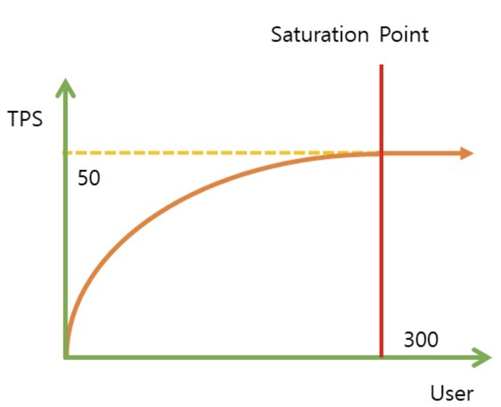
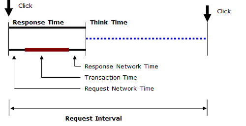

성능 테스트에서의 성능이란 시스템이 정해진 요구 사항을 만족하면서 얼마나 효율적으로, 안정적으로 작동하는지를 말하는 것이라고 생각한다.

단, 자원 중심으로만 보는 것이 아니라, 각 관점에 따라서 챙겨야 하는 성능이 달라지게 된다.

예를 들어, 올리브영 블랙 프라이데이에 맞춰서 정각에 쿠폰을 클릭해야 하는 사용자와 블로그를 읽는 사용자의 시선이 다르다.

성능은 사용자의 만족도, 비즈니스에 많은 영향을 주기 때문에 중요하게 봐야 한다.

## 성능 테스트 지표

---

성능 테스트 지표는 매우 다양하며, 각 서비스의 특성에 따라 중요하게 보는 지표는 달라진다.

그렇다면 주요한 지표들에 대해서만 살펴보자.

### 1. User

- Available User: 접속 중인 사용자
- Concurrent User: 동시 사용자(inactive+active)
  - 웹 페이지를 띄워 둔 사용자 ⇒ 언제든 부하를 줄 수 있는 사용자
  - 이 용어가 접속 중인 사용자 수로 해석되나, 동시에 시스템에 트랜잭션을 유발시키는 사용자로 해석되기도 한다.
- Active User: 클릭, 데이터 요청 등을 통해 결과를 기다리는 사용자 = 서버에 부하를 주고 있는 사용자
  - 서버의 처리 능력과 응답 시간에 직접적인 영향을 미친다.
- Inactiver User: 결과를 읽고 있거나, 요청을 위한 값을 입력하는 중으로 다음 요청까지 대기하는 사람
- VUser: 성능 테스트할 때 가상으로 만드는 사용자이다.

### 2.TPS
1초당 처리할 수 있는 트랜잭션 수이다.

- scale out/up을 통해 증가 시킬 수 있다.

이때, 서버가 인식하는 트랜잭션, 사용자가 인식하는 트랜잭션은 다르다.

즉, DB가 데이터를 몇 건 처리했냐 보다는 고객의 업무를 빨리 처리하는 것이 성능에서 중요하다.

따라서 성능 테스트 시 처리량의 평가 단위는 고객의 업무 처리 건수가 되는 것이 좋을 수 있다.

요청이 증가할 수록 처리량이 선형적으로 증가하다가 어느 순간부터 증가하지 않는 지점을 **Saturation point(임계점)**라고 하며, 이때의 동시 사용자 수가 해당 서비스의 **최대 허용 동시 사용자**이다.

- 성능 개선이 이루어지지 않은 서비스의 경우, saturation point를 지나면 TPS가 떨어지기도 한다.

## 3. 응답 시간
사용자가 서버에 요청 한 시간부터 응답을 받을 때까지의 시간을 말한다.

- Network time(latency time): 서버 요청 시 request, response 까지 소요되는 네트워크 시간
- transaction time: 실제 트랜잭션이 처리되는 시간
- Think time: 사용자가 응답을 받은 후, 화면을 보는 등의 작업 시간
  - ex)  게시물 클릭 후 인스타 그램의 게시물을 보는 시간

이 모든 시간을 포함한 것이 resquest interval이다.

## 성능 테스트 종류

---

### 1. Load Test

부하가 임계치에 도달하기 전까지(예상 부하)의 시점에서 안정적으로 동작하는지 평가한다.

- 목적: 예상되는 부하 상태에서의 시스템의 최대 처리량, 응답 시간등을 파악한다.

### 2. Stress Test

시스템 자원에서 처리할 수 없는 많은 수의 동시 사용자가 부하를 일으켜 어플리케이션의 동작을 평가한다.

- 목적: 시스템의 오류, 중단점을 식별하고, 시스템이 어떻게 복구 되는 지(실패 후의 동작)를 확인한다.
- 결과로 나오는 문제는 동기화 문제, 메모리 누수, 경쟁 조건 등이 있다.

### 3. spike test

예상되는 부하 이상의 증가를 단기간 동안 반복적으로 증가시킬 때 나타나는 성능을 평가한다.

- stress test의 하위 테스트

### 4. endurance test

긴 시간 동안 일정 부하(과부하를 일으키는 것 X)를 가하여 시스템의 안정성 및 메모리 누수, 리소스 부족 문제, 장애 등을 평가한다.

### 5. scalability test

사용자 수, 트랜잭션 수, 데이터 양 등과 같은 비 기능 측면에서 시스템이 확장할 수 있는지 평가한다.

- 목적: 확장하지 못하도록 막는 시스템의 최대치가 무엇인지 확인한다.

### 6. volume test

처리해야 하는 많은 양의 데이터를 가진 시스템의 효율성을 확인하기 위한 테스트이다.

- 목적: 데이터 손실 여부, 시스템 자원, 병목 구간 식별 등을 확인한다.

# 병목 현상

---

병목 현상은 시스템 특정 부분이 전체적인 처리 속도를 떨어뜨리는 현상을 말한다.
병목 현상을 파악하는 것은 시스템 확장성에 필수적이며 효율성과 안정성을 높일 수 있다.

## 주요 병목 지점
- CPU: 과부하 상태의 CPU로 인해 성능 저하 발생한다. 비효율적인 코드, 다중 프로세스 수행 등이 원인이 될 수 있다.
- 메모리: 많은 데이터를 처리하거나, 메모리 누수, 메모리 소모가 큰 시스템을 실행하면서 성능 저하가 발생한다.
- 디스크 I/O: DB 쿼리나 파일 읽기, 쓰기 작업이 빈번하여 성능이 저하되거나, 디스크 I/O 속도가 느린 경우 발생한다.
- 네트워크: 많은 데이터가 전송될 때 대역폭이 부족해 전송 속도가 느려진다.
- 데이터 베이스: 비효율적인 쿼리, 데이터 중복, 인덱스 부족 등으로 인해 과부하 or 대규모 데이터 처리 시 성능 저하
- Java, springboot의 경우 GC, 스레드와 동시성 문제로 인해 성능이 저하될 수 있다.
  - Third-party Services and 외부 API 연계

## 병목 지점 식별하는 방법
- 모니터링 도구: 어느 구간이 문제인지 확인하기 위해 사용
- 프로파일링 도구: 문제되는 부분을 발견했을 때 근본적인 원인을 찾기 위해서 사용
  - 대규모 부하 환경의 경우, dump도구를 많이 사용함(ptrace로 시스템 콜 모니터링, pmap로 메모리 스냅샷, 자바의 경우 thread dump 추출)
- 로그 및 추적 분석

병목 현상을 분석하는 기법에 대해 가이드라인을 제시해주는 글은 [해당 링크](https://www.linkedin.com/pulse/techniques-performance-bottleneck-analysis-raj-jose/)에 있다.

- trending: 성능 문제의 동작과 빈도 살펴보기
- 상관 관계: 성능 지표 간의 관계를 설정한다.(대표적으로 사용자 지표와 서버 측 지표를 비교)
- 비교: 허용 가능한 성능과 허용 불가능한 성능을 비교한다.
- 제거: 병목 현상이 발생한 시스템에서 특정 시스템 구성 요소를 제거하고 다른 구성 요소에 집중하는 방법(DB서버를 제거하고 시스템만 테스트 하는 등)
- 패턴 매칭: 분석 중인 시스템의 성능 문제가 일반적으로 나타나는 문제와 비슷한지 패턴을 검사한다.

# 성능 테스트 도구 종류

---

부하 테스트 도구는 JMeter, Gatling, 내구성(endurance) 테스트 도구는 k6, nGrinder, 스트레스 테스트 도구는 locust, blazemeter 이렇게 구분해볼 수 있다. (장점을 가진 게 이 부분이지 다 가능함)

### 1. JMeter

- 다양한 프로토콜 지원: 웹뿐만 아니라 데이터베이스, LDAP 등을 테스트할 수 있음
- 다양한 플러그인 지원: 사용자 친화적인 보고서, 그래프 생성 가능
- 단점: 단일 컴퓨터에서 멀티 스레딩을 이용하기 때문에 스레드 수가 많아질 수록 메모리, CPU 사용량이 많아져 대규모 테스트에서 어려움이 있을 수 있다.

주로 웹 어플리케이션, API 부하 테스트를 진행하며 소,중 규모 테스트이다. (대규모는 분산 구성이 필요)

### 2. Gatling

- scala 언어 기반, 강력하고 가독성 높은 코드 기반으로 시나리오 작성 가능
- JVM 성능을 극대화하기 때문에 적은 리소스로 대규모 부하를 처리할 수 있다.
- **동시에** 많은 요청을 전송할 수 있는 기술이 적용되어 있음
- HTML 테스트 보고서
- 장단점
  - 장점: 높은 성능, 대규모 테스트에 적합
  - 단점: HTTP외의 프로토콜 지원이 제한적

주로, 고성능 환경에서의 성능 테스트, HTTP 기반 웹 어플리케이션 부하 및 스트레스 테스트

### 3. nGrinder

- 스크립트 레코딩: 웹 브라우저에서 사용자 동작을 녹화하여 테스트 스크립트를 생성할 수 있음
- 컨트롤러, 에이전트로 구성된 분산 아키텍처로 **대규모 분산 테스트 수행** 가능
  - controller: 웹 인터페이스 제공, 테스트 결과 수집하여 통계를 보여줌
  - agent: controller의 명령을 받아 작업을 수행하는 곳
    - 프로세스 수 * 스레드 수 = VUser를 생성하여 부하를 발생시킨다.
- groovy, jython으로 스크립트를 작성할 수 있음
- 장단점
  - 장점: 분산 부하 테스트에 최적화, 쉽게 커스터마이징 가능
  - 단점: 다양한 플러그인 X, 대규모 스크립트 관리가 어려울 수 있음

주로, 대규모의 분산 부하 테스트와 RESTful api와 같은 특정 프로토콜의 대규모 테스트에 적합하다.

### 4. k6

- JavaScript를 사용하여 테스트 스크립트를 작성할 수 있다.
- CLI 환경에서 실행되고, DevOps 환경 테스트에 적합하다.
- 또한, 클라우드 기반으로 대규모 테스트를 수행할 수 있다.

주로 자동화된, 지속적인 성능 테스트에 적합하다.

### 5. Locust

- Python 기반
  - python으로 테스트 스크립트 작성
  - python 라이브러리를 통해 테스트 로직을 세부적으로 커스터마징 가능
- 마스터-슬레이브 구조를 통해 수천 명의 동시 접속자 같은 대규모 테스트에 적합
- 웹 UI에서 실시간으로 부하 조절이 가능하다. ⇒ 테스트 중 동적으로 부하를 조절할 수 있음