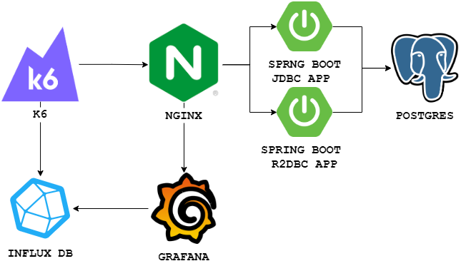
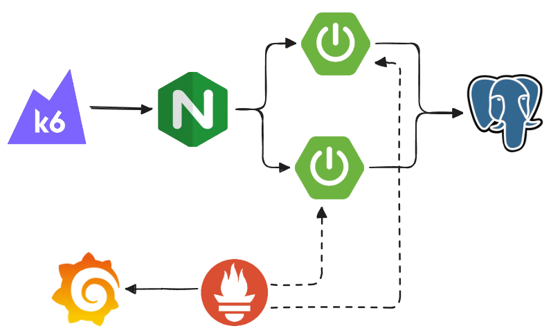

# 출처 
- [원본 Github 프로젝트](https://github.com/GaetanoPiazzolla/spring-boot-jdbc-vs-r2dbc)

# Architecture
<a></a>
<a></a>
# 프로젝트 설명 
```
├── LICENSE
├── README.md
├── **db**
├── **deployment**
├── **grafana**
├── img
├── **k6-testing**
├── **nginx**
├── **prometheus**
├── **spring-jdbc**
├── **spring-r2dbc**
├── test-specimens-new
└── test-specimens-old
```

## k6 docker-compose
```yaml
services:
  k6:
    container_name: k6
    image: loadimpact/k6:latest
    ports:
      - "6565:6565"
    environment:
      - K6_OUT=influxdb=http://influxdb:8086/k6
    volumes:
      - ./js:/k6-scripts
```
environment의 K6_OUT 설정으로 k6 테스트 매트릭을 influxdb에 출력, 적재합니다 

## k6 스크립트 
```
export default function () {
  const url = `http://nginx:4000/spring-${__ENV.TYPE}/`
  ...
  const requests = {
    'Get_books': {
      method: 'GET',
      url: url +'books/simple',
      params: params,
    }
  };
  const responses = http.batch(requests);
  const getResp = responses['Get_books'];

  check(getResp, {
    'status is 200': (r) => r.status === 200,
  }) || getErrorRate.add(1);

  getTrend.add(getResp.timings.duration);
}
```
requests 에서 Get_books 로 요청한 세팅을   const getResp = responses['Get_books']; 로 받습니다
받아온 정보에서 check 함수로 metric 분석해서 getTrend 라는 trend 에 저장합니다

## nginx 설정
```shell
http {
  server {
    ...
    listen 4000;

    location /spring-r2dbc/ {
      proxy_pass http://spring-r2dbc:8080/;
    }
    location /spring-jdbc/ {
        proxy_pass http://spring-jdbc:8080/;
    }
  }
}    
```
k6에서 nginx 로 요청을 보내고 nginx 에선 api prefix에 따라서 요청을 routing 합니다 

## spring 설정 
build.gradle 
```groovy
dependencies {
    implementation 'io.micrometer:micrometer-registry-prometheus'
}
```


# Reference
- [원본 Github 프로젝트](https://github.com/GaetanoPiazzolla/spring-boot-jdbc-vs-r2dbc)