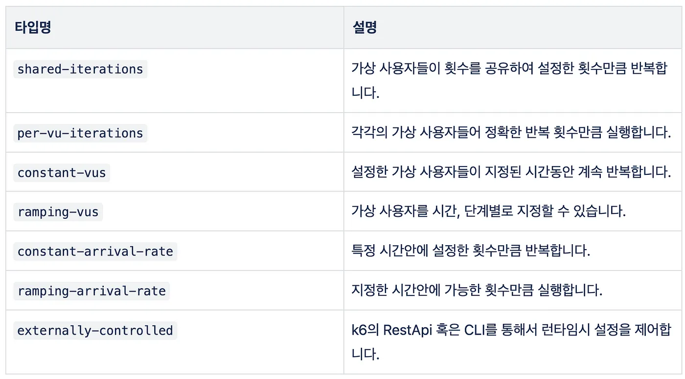
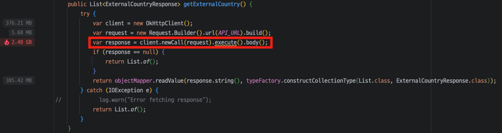
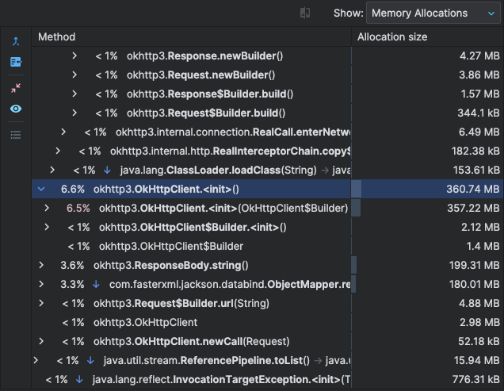
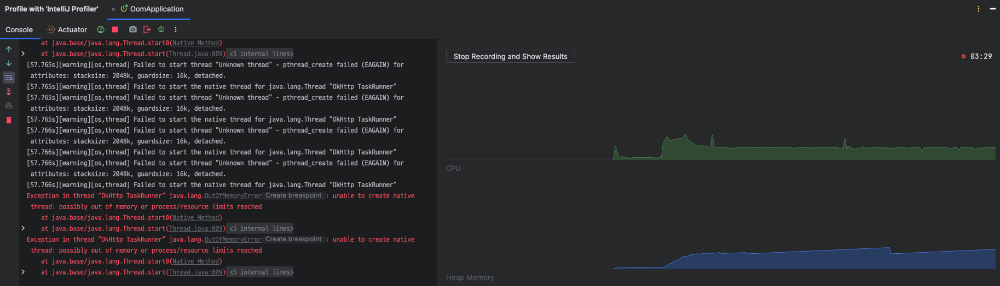
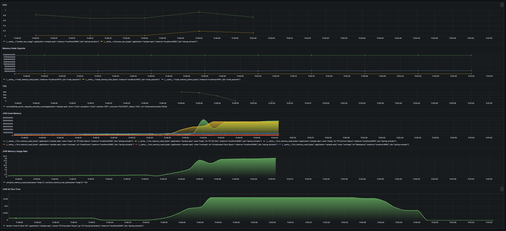
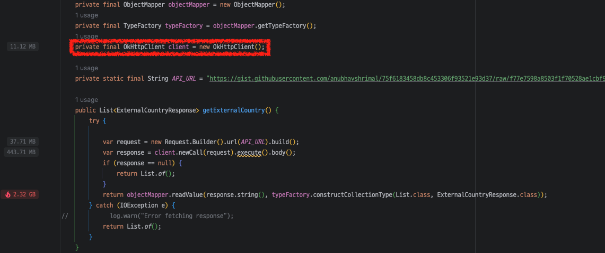
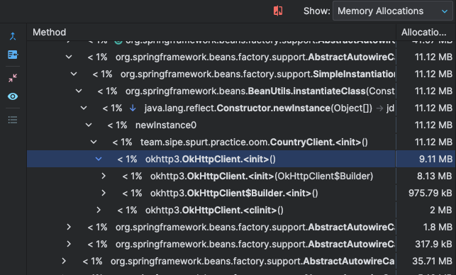
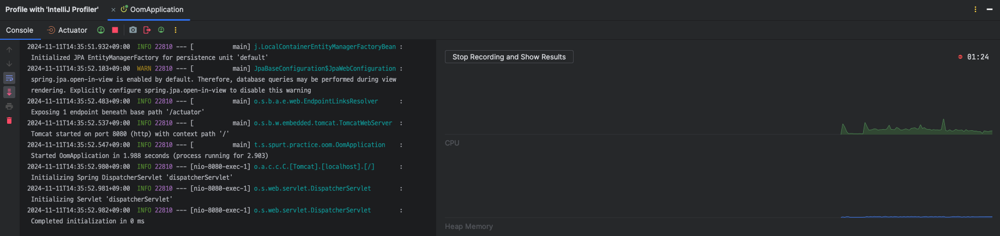
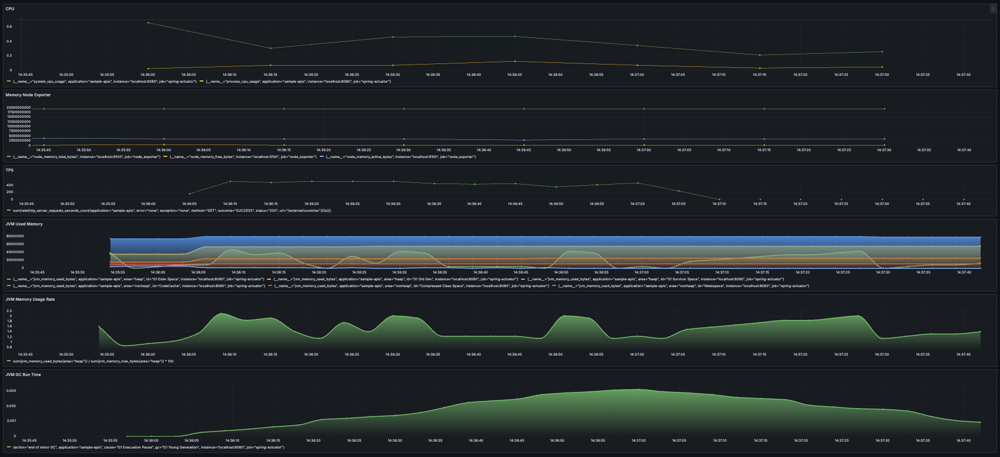

# SIPE 3기 1차 미션: 스프링 퍼포먼스 트랙 - 2주차
> 선택한 도구에 대한 학습 및 실습

## 1. k6란?

Grafana Labs가 운영하는 오픈소스 성능 테스트 도구로, JMeter 보다는 최근인 2017년에 출시되었습니다. 그런데도 불구하고 k6는 뛰어난 성능과 개발 편의성을 발판으로 빠르게 점유율을 높여나가고 있습니다. CLI에 친숙한 개발자라면 오히려 더 쉽게 설치와 세팅이 가능하고, k6 공식문서도 현대적이면서, 깔끔한 Demo 코드도 지원하고 있기 때문에 빠르게 설치하고 테스트를 할 수 있습니다.


### 1.1. 간단한 설치 및 테스트
- JMeter는 설치가 쉬우며 Homebrew를 통해 빠르게 설치할 수 있지만, Java 설치와 환경변수 설정이 필요하고 일부 테스트에서는 추가 플러그인 설치가 필요하여 번거로울 수 있습니다. 그에 반해, k6는 해당 작업이 필요 없습니다.

### 1.2. 스크립트의 용이성
- JMeter는 스크립트를 Import/Export할 때 XML 기반으로 관리가 가능합니다. 하지만, 테스트 시나리오를 파악하려면 수백 라인의 XML을 읽거나 GUI로 Import해야 이해가 쉽습니다.
- 반면에 k6는 웹 개발자에게 친숙한 JavaScript로 작성되어 있어 테스트 시나리오를 쉽게 확인할 수 있습니다.

#### 1.2.1. 공식문서 Demo Code
```javascript
import http from 'k6/http';
import { sleep } from 'k6';

export const options = {
    vus: 10,                // 10 Users
    duration: '30s',        
};

// 1. init Code
export function setup() {
    // 2. Setup Code
}

export default function () {
    // 3. VU Code
    http.get('https://test.k6.io');
    sleep(1);
}
```
### 1.2.2. 성능
k6는 다음 두 가지 대표적인 장점을 가지고 있습니다.
1. Go 언어로 작성된 뛰어난 처리 성능: k6 라이브러리는 Go 언어로 작성되어 있어, 더 적은 수의 로드 생성기로도 많은 사용자를 만들어낼 수 있습니다.
2. Java 의존성 제거: JMeter는 Java에 의존하여 설치 및 최소 메모리 요구 사항이 있습니다. JMeter 공식 문서에서는 Java Heap Memory 확보를 위해 1GB 이상의 메모리를 권장합니다. k6는 JavaScript 파일을 실행하기 때문에 Java 설치가 필요 없으며 고정 메모리 할당 부담이 적습니다. AWS EC2 인스턴스에서 메모리 비용을 절감할 수 있어 최적화된 비용으로 테스트를 수행할 수 있습니다.

### 1.2.3 의존적인 플러그인
JMeter는 GUI 또는 테스트에 필요한 플러그인을 추가로 설치해야 하며, 환경이 바뀔 때마다 다시 설치하는 번거로움이 있습니다.
반면, k6는 JavaScript 라이브러리로 필요한 기능이 대부분 기본 제공되며 import 후 바로 사용할 수 있습니다.


### 1.2.4 k6 Options
k6는 테스트 코드에 작성된 option 조건대로 테스트가 수행됩니다.
option은 시나리오에 따라 설정을 직접 할 수 있고, 설정할 수 있는 필드도 많기 때문에 [여기에서](https://k6.io/docs/using-k6/options) 읽어보시길 바라며, 저희 팀이 간단하게 설정했던 옵션은 아래와 같습니다.

```javascript
// 모수는 테스트마다 변경하며 진행하였고, 아래 코드는 예시로 작성되어있습니다.

export const options = {
    batchPerHost: 10,
    scenarios: {
        payment_scenario: {
            vus: 100,
            exec: 'payment_scenario',
            executor: 'per-vu-iterations',
            iterations: 1
        }       
    }
};
```
- batchPerHost
동일한 호스트 이름에 동시/병렬 연결의 최대수를 가상 사용자에게 세팅합니다.
- scenarios
실행할 시나리오를 나열합니다. 각 시나리오는 시나리오의 설정대로 다르게 동작할 수 있습니다. 저희는 결제 시나리오대로 각 사용자별로 딱 한 번만 진행하면 되었기에 위와 같이 작성하였습니다.
[Scenarios Documents](https://k6.io/docs/using-k6/scenarios/)
- vus
테스트할 가상 사용자를 설정합니다.
- executor
k6에는 테스트 컨셉의 다양한 로드 발생기가 있습니다. 아래는 로드 발생기의 리스트와 간단한 설명을 공유드립니다. 자세한 설명은 [Executors Documents](https://k6.io/docs/using-k6/executors)에서 읽어보신 후, 용도에 맞게 도입을 해보시기 바랍니다.


## 2. k6 실습
### 2.1. 부하 테스트 및 병목 파악해보기
> ### 테스트 도구
> - Grafana
> - prometheus
> - k6
> - intellij profiler
#### 2.1.1. 부하 테스트 스크립트 양식
- script.js 
``` javascript
import http from "k6/http";
import { sleep } from 'k6';

export const options = {
    vus: 50,
    duration: '60s',
    noConnectionReuse: true,
}

export default async function() {
    const url = 'http://localhost:8080/external/countries';
    call(url)    
}

async function call(url) {
    http.get(url);
}
```
#### 2.1.2. 부하테스트 실행 결과
- k6 실행 결과
``` text
k6 run script.js

         /\      Grafana   /‾‾/
    /\  /  \     |\  __   /  /
   /  \/    \    | |/ /  /   ‾‾\
  /          \   |   (  |  (‾)  |
 / __________ \  |_|\_\  \_____/

     execution: local
        script: script.js
        output: -

     scenarios: (100.00%) 1 scenario, 50 max VUs, 1m30s max duration (incl. graceful stop):
              * default: 50 looping VUs for 1m0s (gracefulStop: 30s)

WARN[0072] Request Failed                                error="Get \"http://localhost:8080/external/countries\": request timeout"
WARN[0072] Request Failed                                error="Get \"http://localhost:8080/external/countries\": request timeout"
WARN[0072] Request Failed                                error="Get \"http://localhost:8080/external/countries\": request timeout"
WARN[0072] Request Failed                                error="Get \"http://localhost:8080/external/countries\": request timeout"
WARN[0072] Request Failed                                error="Get \"http://localhost:8080/external/countries\": request timeout"
WARN[0072] Request Failed                                error="Get \"http://localhost:8080/external/countries\": request timeout"
WARN[0072] Request Failed                                error="Get \"http://localhost:8080/external/countries\": request timeout"
WARN[0072] Request Failed                                error="Get \"http://localhost:8080/external/countries\": request timeout"
WARN[0072] Request Failed                                error="Get \"http://localhost:8080/external/countries\": request timeout"
WARN[0072] Request Failed                                error="Get \"http://localhost:8080/external/countries\": request timeout"
WARN[0072] Request Failed                                error="Get \"http://localhost:8080/external/countries\": request timeout"
WARN[0072] Request Failed                                error="Get \"http://localhost:8080/external/countries\": request timeout"
WARN[0072] Request Failed                                error="Get \"http://localhost:8080/external/countries\": request timeout"
WARN[0072] Request Failed                                error="Get \"http://localhost:8080/external/countries\": request timeout"
WARN[0073] Request Failed                                error="Get \"http://localhost:8080/external/countries\": request timeout"
WARN[0073] Request Failed                                error="Get \"http://localhost:8080/external/countries\": request timeout"
WARN[0073] Request Failed                                error="Get \"http://localhost:8080/external/countries\": request timeout"
WARN[0073] Request Failed                                error="Get \"http://localhost:8080/external/countries\": request timeout"
WARN[0073] Request Failed                                error="Get \"http://localhost:8080/external/countries\": request timeout"
WARN[0073] Request Failed                                error="Get \"http://localhost:8080/external/countries\": request timeout"
WARN[0074] Request Failed                                error="Get \"http://localhost:8080/external/countries\": request timeout"
WARN[0074] Request Failed                                error="Get \"http://localhost:8080/external/countries\": request timeout"
WARN[0074] Request Failed                                error="Get \"http://localhost:8080/external/countries\": request timeout"
WARN[0074] Request Failed                                error="Get \"http://localhost:8080/external/countries\": request timeout"
WARN[0074] Request Failed                                error="Get \"http://localhost:8080/external/countries\": request timeout"
WARN[0074] Request Failed                                error="Get \"http://localhost:8080/external/countries\": request timeout"
WARN[0075] Request Failed                                error="Get \"http://localhost:8080/external/countries\": request timeout"
WARN[0075] Request Failed                                error="Get \"http://localhost:8080/external/countries\": request timeout"
WARN[0076] Request Failed                                error="Get \"http://localhost:8080/external/countries\": request timeout"
WARN[0076] Request Failed                                error="Get \"http://localhost:8080/external/countries\": request timeout"
WARN[0076] Request Failed                                error="Get \"http://localhost:8080/external/countries\": request timeout"
WARN[0076] Request Failed                                error="Get \"http://localhost:8080/external/countries\": request timeout"
WARN[0076] Request Failed                                error="Get \"http://localhost:8080/external/countries\": request timeout"
WARN[0076] Request Failed                                error="Get \"http://localhost:8080/external/countries\": request timeout"
WARN[0076] Request Failed                                error="Get \"http://localhost:8080/external/countries\": request timeout"
WARN[0077] Request Failed                                error="Get \"http://localhost:8080/external/countries\": request timeout"
WARN[0077] Request Failed                                error="Get \"http://localhost:8080/external/countries\": request timeout"
WARN[0077] Request Failed                                error="Get \"http://localhost:8080/external/countries\": request timeout"
WARN[0077] Request Failed                                error="Get \"http://localhost:8080/external/countries\": request timeout"
WARN[0077] Request Failed                                error="Get \"http://localhost:8080/external/countries\": request timeout"
WARN[0078] Request Failed                                error="Get \"http://localhost:8080/external/countries\": request timeout"
WARN[0078] Request Failed                                error="Get \"http://localhost:8080/external/countries\": request timeout"
WARN[0080] Request Failed                                error="Get \"http://localhost:8080/external/countries\": request timeout"
WARN[0082] Request Failed                                error="Get \"http://localhost:8080/external/countries\": request timeout"
WARN[0082] Request Failed                                error="Get \"http://localhost:8080/external/countries\": request timeout"
WARN[0082] Request Failed                                error="Get \"http://localhost:8080/external/countries\": request timeout"
WARN[0083] Request Failed                                error="Get \"http://localhost:8080/external/countries\": request timeout"
WARN[0084] Request Failed                                error="Get \"http://localhost:8080/external/countries\": request timeout"
WARN[0086] Request Failed                                error="Get \"http://localhost:8080/external/countries\": request timeout"

     data_received..................: 62 MB  685 kB/s
     data_sent......................: 706 kB 7.8 kB/s
     http_req_blocked...............: avg=208.65µs min=51µs     med=164µs    max=4.48ms p(90)=263.4µs  p(95)=336µs
     http_req_connecting............: avg=165.84µs min=42µs     med=135µs    max=4.45ms p(90)=208µs    p(95)=268µs
     http_req_duration..............: avg=619.08ms min=67.5ms   med=139.37ms max=1m0s   p(90)=154.98ms p(95)=164.46ms
       { expected_response:true }...: avg=153.82ms min=104.11ms med=142.07ms max=10.08s p(90)=158.67ms p(95)=164.35ms
     http_req_failed................: 33.99% 2052 out of 6037
     http_req_receiving.............: avg=81.01µs  min=0s       med=58µs     max=9.54ms p(90)=122µs    p(95)=166µs
     http_req_sending...............: avg=23.34µs  min=3µs      med=17µs     max=4.39ms p(90)=31µs     p(95)=39µs
     http_req_tls_handshaking.......: avg=0s       min=0s       med=0s       max=0s     p(90)=0s       p(95)=0s
     http_req_waiting...............: avg=618.97ms min=67.42ms  med=139.29ms max=1m0s   p(90)=154.91ms p(95)=164.33ms
     http_reqs......................: 6037   67.078196/s
     iteration_duration.............: avg=619.38ms min=67.8ms   med=139.59ms max=1m0s   p(90)=155.31ms p(95)=164.67ms
     iterations.....................: 6037   67.078196/s
     vus............................: 1      min=1            max=50
     vus_max........................: 50     min=50           max=50


running (1m30.0s), 00/50 VUs, 6037 complete and 1 interrupted iterations
default ✓ [======================================] 50 VUs  1m0s
```
- 서버 에러 메시지
``` 
[57.766s][warning][os,thread] Failed to start the native thread for java.lang.Thread "OkHttp TaskRunner"
[57.766s][warning][os,thread] Failed to start thread "Unknown thread" - pthread_create failed (EAGAIN) for attributes: stacksize: 2048k, guardsize: 16k, detached.
[57.766s][warning][os,thread] Failed to start the native thread for java.lang.Thread "OkHttp TaskRunner"
Exception in thread "OkHttp TaskRunner" java.lang.OutOfMemoryError: unable to create native thread: possibly out of memory or process/resource limits reached
	at java.base/java.lang.Thread.start0(Native Method)
	at java.base/java.lang.Thread.start(Thread.java:809)
	at java.base/java.util.concurrent.ThreadPoolExecutor.addWorker(ThreadPoolExecutor.java:945)
	at java.base/java.util.concurrent.ThreadPoolExecutor.processWorkerExit(ThreadPoolExecutor.java:1013)
	at java.base/java.util.concurrent.ThreadPoolExecutor.runWorker(ThreadPoolExecutor.java:1150)
	at java.base/java.util.concurrent.ThreadPoolExecutor$Worker.run(ThreadPoolExecutor.java:635)
	at java.base/java.lang.Thread.run(Thread.java:840)
```

#### 2.1.3. 부하테스트 실행 결과 분석
#### 2.1.3.1. 요청 실패율 (http_req_failed)
- **실패율**: 33.99%
- 총 6,037건의 요청 중 2,052건이 실패하여 높은 실패율을 보였습니다. 대부분의 실패는 "request timeout" 오류로 인해 발생했으며, 이는 서버가 요청을 제시간에 처리하지 못했음을 나타냅니다. 과도한 부하가 원인일 가능성이 큽니다.

#### 2.1.3.2. 요청 지연 시간 (http_req_duration)
- **평균 지연 시간**: 619.08ms
- **최소 지연 시간**: 67.5ms
- **최대 지연 시간**: 1분 (일부 요청이 매우 오래 걸림)
- **90번째 백분위수**: 154.98ms
- **95번째 백분위수**: 164.46ms

대부분의 요청은 합리적인 시간 내에 완료되었지만, 일부 요청은 극단적으로 지연되면서 전체 평균 응답 시간이 증가했습니다.

#### 2.1.3.3. 초당 거래 수 (TPS)
- **초당 요청 수**: 67.08/s
- 총 6,037건의 요청이 성공적으로 완료되어 목표에 근접했으나 실패율이 높았습니다.

#### 2.1.3.4. 데이터 송수신량
- **수신된 데이터**: 62 MB (초당 685 kB)
- **송신된 데이터**: 706 kB (초당 7.8 kB)

### 2.2 에러 모니터링 내용 분석
#### 병목 의심 구간

#### 병목 의심 구간 메모리 할당량 확인

#### Intellij Profiler 결과

#### 그라파나 모니터링 결과

#### 2.2.1. TPS (Transactions per Second):
TPS 그래프에서 초당 요청 수가 일정 시간 동안 증가했다가, 이후 급격히 감소하는 모습이 보입니다. 이 급격한 감소는 서버가 OOM으로 인해 중단되면서 요청 처리가 멈춘 상황을 반영합니다. 요청이 많아지면서 메모리 사용량도 같이 증가하게 되어, 결국 시스템이 OOM 상태로 진입한 것으로 보입니다.
#### 2.2.2. JVM Used Memory:
이 그래프에서 Old Generation 메모리 사용량이 급격히 증가하는 것을 볼 수 있습니다. 11:49:20 경부터 Old Generation 메모리가 급속히 증가하여 최고점에 도달한 후 유지되고 있으며, Garbage Collection(GC)으로도 해소되지 않는 모습을 보입니다. 이는 메모리를 계속 사용하는 객체가 Old Generation 영역에 쌓이면서 결국 힙 메모리가 포화 상태에 이른 것을 의미합니다.
메모리 사용량이 GC로 해소되지 않고 지속적으로 증가하는 것은 메모리 누수 또는 지속적인 메모리 할당 증가로 인해 OOM이 발생했음을 시사합니다.
#### 2.2.3. JVM Memory Usage Rate:
전체 힙 메모리 사용률이 급격히 상승하여 20% 이상에 도달하고, 이후에는 상승한 수준을 유지합니다. 이는 요청량 증가와 함께 JVM 메모리 사용률이 높아지다가 결국 Garbage Collection이 해결하지 못하는 메모리 누수나 메모리 사용 패턴이 반복되었음을 나타냅니다.
메모리 사용률이 높아지면서 시스템이 점차적으로 메모리 부족 상태에 빠졌고, 결국 OOM으로 인해 서버가 중단된 것으로 보입니다.
#### 2.2.4. JVM GC Run Time:
GC 실행 시간 그래프를 보면 GC가 반복적으로 발생하는 것이 보이지만, 메모리 회수에 성공하지 못하고 일정 수준 이상의 메모리 사용량이 유지되고 있습니다. GC가 정상적으로 작동하지만 충분한 메모리를 해제하지 못해 OOM이 발생한 것을 알 수 있습니다.
GC가 자주 발생하더라도 메모리 누수 문제로 인해 Old Generation 메모리가 계속 누적되면, 결국 OOM으로 이어질 수 있습니다.
이 모니터링 결과는 TPS 증가로 인해 메모리 사용량이 급격히 증가하면서 메모리 누수 또는 지속적인 메모리 할당 증가가 OOM을 초래했다는 것을 보여줍니다. OOM 방지를 위해서는 다음과 같은 조치를 고려할 수 있습니다:

### 2.3 해결 방법
- 메모리 누수 점검: 사용 중인 객체들이 해제되지 않고 지속적으로 메모리를 차지하고 있는지 확인합니다.
- GC 튜닝: GC 전략을 조정하여 Old Generation 메모리를 보다 효율적으로 관리할 수 있도록 합니다.
- TPS 제어 및 부하 분산: 트래픽이 급격히 증가할 때 부하를 분산시키는 방법을 통해 메모리 소모를 줄입니다.

#### 2.3.1. 메모리 누수 점검
#### 병목 의심 구간 수정

#### 병목 의심 구간 메모리 할당량 확인

#### Intellij Profiler 결과

#### 그라파나 모니터링 결과


---
#### REFERENCE
[월급쟁이부자들의 부하테스트를 위한 k6 도입기](https://weolbu.medium.com/%EC%9B%94%EA%B8%89%EC%9F%81%EC%9D%B4%EB%B6%80%EC%9E%90%EB%93%A4%EC%9D%98-%EB%B6%80%ED%95%98%ED%85%8C%EC%8A%A4%ED%8A%B8%EB%A5%BC-%EC%9C%84%ED%95%9C-k6-%EB%8F%84%EC%9E%85%EA%B8%B0-d7c82e7fe65f)

[k6 공식 문서](https://grafana.com/docs/k6/latest/)

