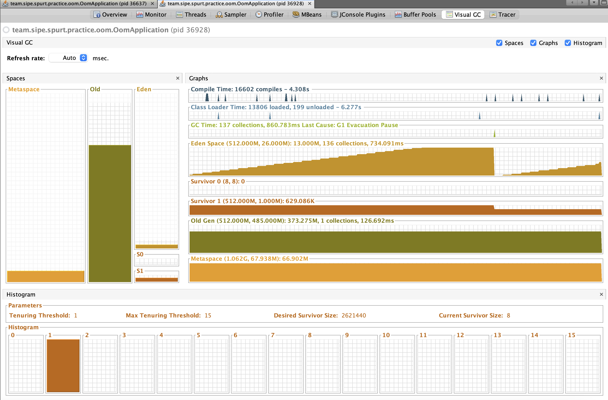

# 2. 부하 테스트 및 모니터링
정리할 내용은 아래와 같습니다.

**2.1. k6와 부하테스트**
- 2.1.1. k6
- 2.1.2. k6 설치와 사용법
- 2.1.3. 예제로 확인해보기 (w. OOM 애플리케이션, IntelliJ Profiler)

**2.2. VisualVM**
- 2.2.1. VisualVM
- 2.2.2. VisualVM 설치와 사용법
- 2.2.3. 예제로 확인해보기 (w. OOM 애플리케이션, VisualVM)

<br>

## 2.1. k6와 부하테스트
### 2.1.1. k6
k6는 성능 및 부하 테스트를 위한 오픈 소스 도구
- 주로 API의 성능을 측정하며, JavaScript로 작성된 스크립트를 사용하여 다양한 시나리오를 시뮬레이션할 수 있음
- 또한 클라우드 환경에서 테스트를 실행하거나, 여러 대의 에이전트를 사용하여 분산 테스트를 수행할 수 있음 (w. k6 operator)

<br>

### 2.1.2. k6 설치와 사용법
> 설치 및 사용법은 클라우드 환경이 아닌 로컬 환경을 기준으로 설명합니다.

#### k6 CLI 설치
```shell
brew install k6
```

#### k6 실행
vu(가상 사용자)와 iteration(반복 횟수)를 지정하여 실행
```shell
k6 run --iterations=100 --vus=10  script.js
```

실행 결과를 json 형태로 저장하고 싶은 경우 아래와 같이 실행
```shell
k6 run --out json=result/test.json script.js
```

실행 과정에서 로그를 남기고 확인하고 싶은 경우 아래 옵션을 추가
```shell
k6 run --console-output "log/log.txt" script.js 
```

옵션에 따라 원하는 값을 출력할 수 있음
> https://k6.io/docs/using-k6/k6-options/reference/#summary-trend-stats

```shell
k6 run --summary-trend-stats="med,p(95),p(99.9)" script.js
```

#### 주요 지표 정리
| 메트릭                      | 설명                                                              |
|-----------------------------|------------------------------------------------------------------|
| `data_received`             | 수신된 데이터 양(바이트) 및 데이터 수신 속도(B/s)                   |
| `data_sent`                 | 전송된 데이터 양(바이트) 및 데이터 전송 속도(B/s)                   |
| `http_req_blocked`          | 요청을 시작하기 전에 차단된 시간(평균, 최소, 중앙값, 최대, p90, p95) |
| `http_req_connecting`       | TCP 연결을 설정하는 데 걸린 시간(평균, 최소, 중앙값, 최대, p90, p95) |
| `http_req_duration`         | 요청의 총 시간(평균, 최소, 중앙값, 최대, p90, p95)                  |
| `http_req_failed`           | 실패한 HTTP 요청의 비율 및 수                                     |
| `http_req_receiving`        | 응답 데이터를 수신하는 데 걸린 시간(평균, 최소, 중앙값, 최대, p90, p95) |
| `http_req_sending`          | 요청 데이터를 보내는 데 걸린 시간(평균, 최소, 중앙값, 최대, p90, p95) |
| `http_req_tls_handshaking`  | TLS 핸드셰이크를 수행하는 데 걸린 시간(평균, 최소, 중앙값, 최대, p90, p95) |
| `http_req_waiting`          | 응답을 기다리는 데 걸린 시간(평균, 최소, 중앙값, 최대, p90, p95)     |
| `http_reqs`                 | HTTP 요청의 총 수 및 초당 요청 수                                  |
| `iteration_duration`        | 각 반복의 지속 시간(평균, 최소, 중앙값, 최대, p90, p95)              |
| `iterations`                | 반복의 총 수 및 초당 반복 수                                        |
| `vus`                       | 가상 사용자의 수(최소, 최대)                                        |
| `vus_max`                   | 최대 가상 사용자 수                                                |

<br>

### 2.1.3. 예제로 확인해보기 (w. OOM 애플리케이션, IntelliJ Profiler)
작성한 JS 기반 스크립트를 통해 부하 생성 및 모니터링하기
- 부하 요청 관련 메트릭은 Grafana를 통해 확인
- 애플리케이션 메트릭은 IntelliJ Profiler를 통해 확인

#### 부하 요청 관련 메트릭 (w. Grafana, InfluxDB)
> 스샷을 다시 뜰려고 찍은거라 시차가 있습니다...

VU 50 설정 후 요청 발생


요청이 지속되면서 RPS 감소 및 응답시간 지연 증가 (이미 OOM 발생)


#### 애플리케이션 메트릭 (w. IntelliJ Profiler)
메모리 할당량을 확인했을 때 `CountryClient.getExternalCountry()` 메서드에서 메모리를 과하게 할당하고 있는 것을 확인할 수 있음


> [!TIP]
> 왜 OOM이 발생할까?
> - 간단하게 생각해보면 DB를 사용할 때 Connection Pool을 사용하는 것과 비슷한 이유라고 이해하시면 될 것 같아요.
> - OkHttpClient 나 RestClient 같은 HTTP Client의 경우에 자원을 효율적으로 사용하기 위해 HTTP Connection을 재활용하는데요.
> - 현재 작성한 코드의 경우 매번 Client를 생성(커넥션 풀 생성)하고, 새로 생성(할당)한 Client를 통해 요청을 보내고 있습니다. (커넥션 풀 재활용 X)
>   - 후술할 VisualVM으로 프로파일링한 결과를 보시면 실제로 요청이 발생함에 따라 메모리와 함께 스레드의 수도 함께 증가하는 추세를 확인할 수 있습니다.
>   - 또한 클라이언트 및 커넥션 풀 생성 시 커넥션 내에 자체적인 타임아웃이 존재하기 때문에 바로 메모리가 해제되지 않고, 추가적인 메모리 누수로 이어지게 됩니다.

<br>

## 2.2. VisualVM
### 2.2.1. VisualVM
VisualVM은 Java 애플리케이션의 성능을 모니터링하고 디버깅하기 위한 도구
- 애플리케이션 모니터링: CPU, 메모리, 스레드 등의 실시간 모니터링
- 프로파일링: CPU 및 메모리 사용량을 분석하여 성능 병목 지점을 찾을 수 있음
- 덤프 분석: 힙 덤프를 분석하여 메모리 누수 및 객체 할당을 확인할 수 있음
- 스레드 분석: 스레드 덤프를 통해 스레드 상태 및 동기화 문제를 분석할 수 있음

### 2.2.2. VisualVM 설치와 사용법
#### 설치
> https://visualvm.github.io/

#### 플러그인 설치
애플리케이션 설치 후 `Tools` - `Plugins`에서 원하는 플러그인 설치

잘 모르겠으면 사용 가능한 플러그인을 모두 설치해도 되지만, 아래 플러그인 정도로도 대부분의 상황에서 프로파일링 가능


#### 사용법


VisualVM 실행 시 좌측 메뉴에 Java 애플리케이션 목록이 노출

원하는 애플리케이션 선택 후 설치한 플러그인을 통해 다양한 지표 및 프로파일링 가능

> CPU 및 메모리 


> 스레드 별 지표


> GC 관련 지표



### 2.2.3. 예제로 확인해보기 (w. OOM 애플리케이션, VisualVM)
> 예제 및 스크립트는 동일

동일한 예제 및 스크립트이기에 메모리로 인한 성능 저하는 동일합니다.

VisualVM으로 애플리케이션 메트릭을 확인했을 때는 메모리 사용의 증가와 함께 앞에서 언급한 스레드의 수도 요청에 따라 계속해서 증가하는 것을 확인할 수 있습니다.

