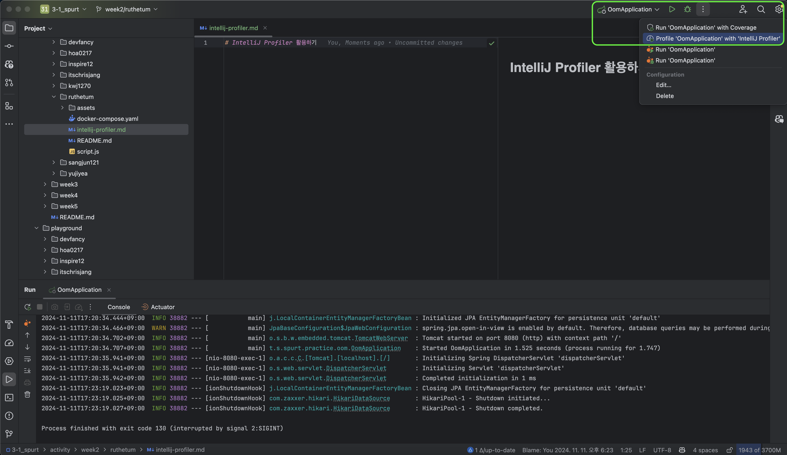
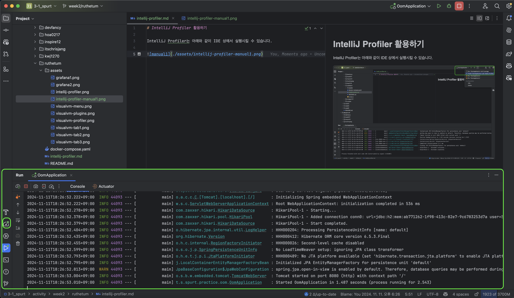
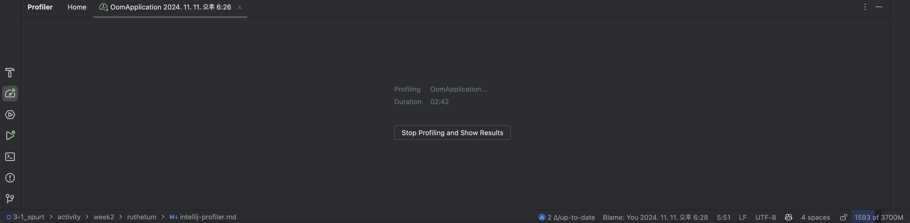
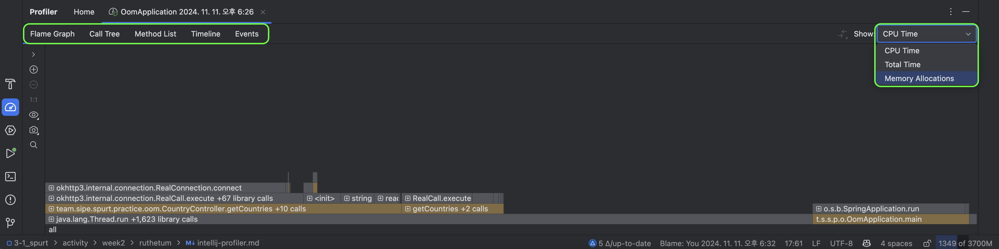
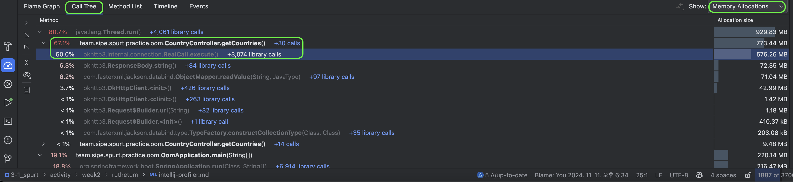
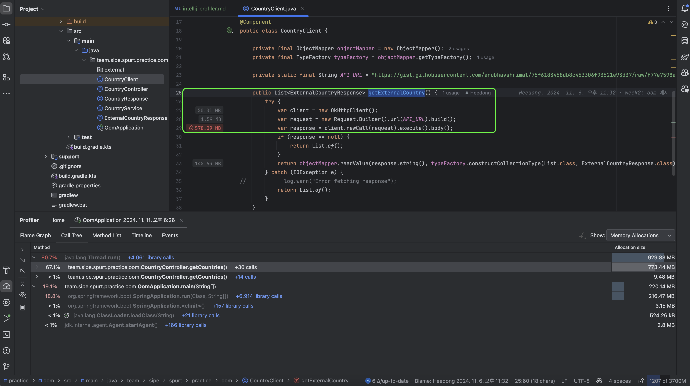

# IntelliJ Profiler 활용하기

> IntelliJ Profiler를 사용하는 방법을 간단하게 정리합니다.

IntelliJ Profiler는 아래와 같이 IDE 상에서 실행시킬 수 있습니다.

실행을 시키면 아래와 같이 평소에 애플리케이션을 실행하는 것처럼 동일하게 실행됩니다.

다만 평소에는 못 보던 시계 모양의 버튼과 해당 버튼에 초록색 불이 들어오는 것을 볼 수 있습니다.

버튼을 눌러보면 아래와 같이 애플리케이션에 대한 프로파일링이 진행되고 있는 것을 볼 수 있습니다.

이후 원하는 기능을 요청하거나 부하를 발생시킨 후 프로파일링을 종료하면 아래와 같은 화면을 볼 수 있습니다.

애플리케이션이 실행되면서 CPU 또는 메모리가 어떤 변수 또는 메서드 호출에 의해 사용(영향)되었는지 확인할 수 있습니다.

> 이번 예제는 메모리 관련 이슈였다보니 메모리 할당을 한번 확인해보겠습니다.

Call Tree(호출 트리)를 선택하고, 메모리 할당을 확인해보면 아래와 같이 okhttp3 패키지 내 `RealCall.execute` 메서드에서 메모리 할당이 많이 일어나는 것을 확인할 수 있습니다.

실제 메서드가 호출된 소스 코드를 확인해보면 좌측에 메모리 할당이 일어나는 부분도 함께 표시되어 있습니다.

