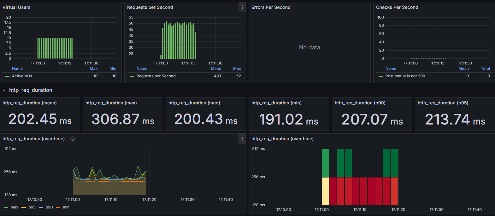
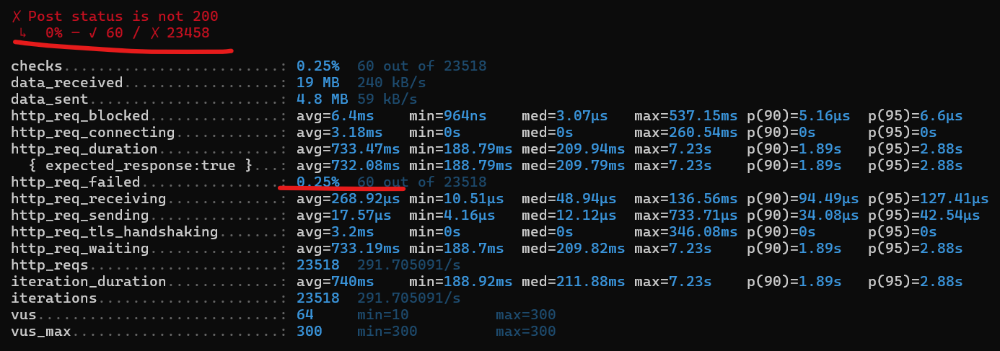
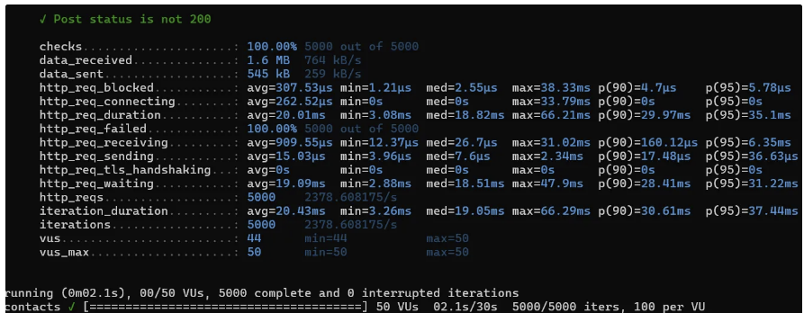
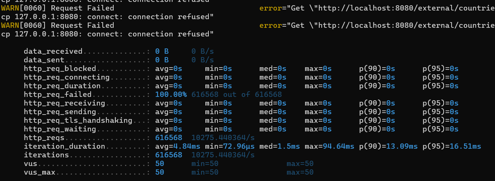

# K6 알아보기

---

## 1. 시나리오

시나리오를 사용하면 VU, 반복 일정을 구체적으로 구성할 수 있으며 workload, 부하 테스트 트래픽 패턴을 모델링 할 수 있다.

| executor | VU와 반복을 어떻게 스케줄링 할지 제어하는 것이다. (테스트 목표와 모델링하려는 트래픽 유형에 따라 달라짐)                                                                                    |
| --- |--------------------------------------------------------------------------------------------------------------------------------------------------|
| startTime | 테스트 시간                                                                                                                                           |
| gracefulStop | **강제로 중지하기 전에 진행 중인 반복을 완료하는 마지막 기간**이다. 테스트 설정 기간, ramp down의 경우 반복이 중단되는데 이 경우 예상치 못한 테스트 결과가 나타날 수 있다. 그래서 설정하는 옵션                            |
| env | 시나리오에 대한 환경 변수 설정                                                                                                                                |
| tags | 테스트 결과를 자세하게 필터링하기 위해서 검사, 임계값, 사용자 정의 메트릭 및 요청을 분류하는 것이다. (https://grafana.com/docs/k6/latest/using-k6/tags-and-groups/#tags-in-results-output) |
| options | 테스트를 실행하는 브라우저에 대한 옵션                                                                                                                            |

### Executor 옵션

- `shared-iterations` : VU 수 간에 반복을 공유하는 executor이다.
    - 단, 반복이 균등하게 분산된다는 보장은 없다.
- `per-vu-iterations` : 각 VU마다 정확하게 분산된 반복을 실행한다.
    - 완료된 반복의 총 수는 vus * iterations이다.
    - 반복 작업 분포가 VU간 균등하므로 작업 속도가 빠른 VU는 남은 테스트 기간 동안 유휴 상태가 되어 효율성이 낮아질 수 있다.
- `constant-vus` : 고정된 수의 VU가 지정된 시간 동안 가능한 만큼 많은 반복을 실행한다.
- `ramping-vus`: 가변적인 VU가 지정된 시간 동안 많은 반복을 실행한다.
    - 다른 옵션과 달리 stage, startVUs, gracefulRampDown을 정의한다.
- `constant-arrival-rate` : 지정된 기간동안 원하는 속도를 달성하기 위해까지 다양한 VU로 고정된 수의 반복을 시작한다.
    - open 모델로 반복은 응답과 독립적으로 시작됨

> closed 모델: 이전 반복이 완료되어야 다음 반복 시작(처리량을 시뮬할 경우 단점이 됨)
>
- `ramping-arrival-rate` : 가변 속도로 반복을 시작하는 실행자이다.
    - 시스템 성능과 상관없이 반복을 시작하고, 특정 기간동안 반복 횟수를 늘리거나 줄이려고 할 때 사용한다.
- `externally-controlled` : CLI, k6 rest api로 테스트 실행 동안 VU 수를 제어할 수 있다.

### Thresholds 옵션

특정 지표에 대한 성능 목표를 만족하는지 확인하고, 목표에 미치지 못하면 테스트 실패 처리가 되며 알림을 받을 수 있어서 이런 경우 사용한다.

Thresholds는 집계 방법을 이용한 표현식(ex. p(90) <300) 으로 조건을 설정한다.

- `abortOnFail` : 임계값을 넘어서면 테스트를 중단하는 옵션
- `delayAbortEval` : 평가를 지연 시키는 옵션으로 테스트 시작 후 지정된 시간이 지난 시점부터 평가를 시작하게 된다.

## 2. 메트릭

테스트의 목표에는 동시성, 처리량, 요청시 응답 시간, 회귀 테스트(SLA를 준수하는지~) 등이 있다.

⇒ 이는 속도, 확장성(부하 증가 시 확장 확인, 부하를 일정 기간 지속하는지 측정), 안정성(부하를 얼마나 잘 견디는지, 반응성), 시스템이 작동 중단된 후의 회복력 등 측면에서 평가해볼 수 있다.

k6는 기본적으로 제공하는 빌트인 메트릭과 커스텀 메트릭이 존재한다.

### 커스텀 메트릭

1. counter

   오류 수와 같은 누적 값을 측정하는 메트릭이다.

    ```jsx
    import http from 'k6/http';
    import { Counter } from 'k6/metrics';
    
    const CounterErrors = new Counter('Errors');
    
    export const options = { thresholds: { Errors: ['count<100'] } };
    
    export default function () {
      const res = http.get('https://test-api.k6.io/public/crocodiles/1/');
      const contentOK = res.json('name') === 'Bert';
      CounterErrors.add(!contentOK);
    }
    ```

2. gauge

   마지막으로 추가된 값을 보관하는, 덮어쓰기가 가능한 메트릭이다.

   응답 시간, 지연 또는 기타 사용자 정의 값 등의 테스트 항목의 마지막 값을 유지할 때 사용된다.

3. rate

   0이 아닌 값의 비율을 나타내는 메트릭이다.

4. trend

   추가된 값에 대한 다양한 통계(최소, 최대, 평균, 비율)를 계산하는 메트릭


## 3. test life cycle

테스트는 아래 단계로 진행된다.

1. `init` : 다른 JS 모듈(라이브러리)를 가져오거나 파일을 로드, 테스트 옵션 설정, 전역 변수 및 함수 정의 등의 테스트 환경을 설정하고, 실행 조건을 초기화하는 단계이다.
    - VU당 한번 실행되며 **필수 실행 단계**이다.
    - export default 부분을 제외하면 init 코드 부분이다.
2. `set up` : 테스트 환경 초기화 or 공통 데이터 불러오기
    - 이때 반환 데이터는 JSON 형식 이어 한다. ⇒ 또한 각 반복 작업에서 공유 상태를 유지하지 않고 데이터의 복사본을 사용한다.
3. `VU code` : VU들이 반복적으로 실행하는 부분이다.
    - HTTP 요청, 메트릭 생성 및 수집, 부하 시나리오에 맞춰 작업 수행을 한다.
    - VU는 설정된 시간동안 해당 함수를 반복하고 그때 마다 쿠키가 초기화되고, TCP연결이 종료되기도 한다.
    - 파일 로드, 모듈 import 불가
4. `teardown()` : 테스트가 완료된 후 자원을 정리하고 결과를 처리할 때 사용
    - setup()에서 반환된 데이터 참조 가능

또한, `handleSummary()` 로 테스트 종료 후 커스텀 요약 보고서를 만들거나, **`scenarios` 옵션으로 특정 시나리오에 맞는 함수를 실행**할 수 있다.

# K6를 사용해보자.

---

## 1. 환경 설정

---

테스트 내용을 일일이 캡처하기는 어려우니 k6를 만든 grafana와 influxdb를 사용해서 모니터링까지 연결해보자.

1. docker-compose.yaml을 사용하여 grafana, influxdb를 실행하자.

   https://github.com/grafana/k6/blob/master/docker-compose.yml 에서 docker-compose.yaml을 받을 수 있다.

2. 이후, grafana에 접속해 data source , dashboard를 import 한다.

## 2. k6 테스트 스크립트 실습

---

k6 테스트를 날려볼 수 있는 https://httpbin.org/ https://test.k6.io/ 가 있다.

### smoke test

최소 부하를 가지고 잘 작동하는지, 기준이 되는 성능 측정 항목을 수집한다.

```jsx
import http from 'k6/http';
import { check } from 'k6';

export const options = {
    vus: 10,
    duration: '20s',

    thresholds: {
        http_req_duration: ['p(99)<1500'],
    },
};

export default function () {
    const payload = JSON.stringify({
        name: 'lorem',
        surname: 'ipsum',
    });
    const headers = { 'Content-Type': 'application/json' };
    const res = http.post('https://httpbin.test.k6.io/post', payload, { headers });

    check(res, {
        'Post status is not 200': (r) => res.status !== 200
    })
}
```

### load test

```jsx
import http from 'k6/http';
import { check } from 'k6';

export const options = {
    discardResponseBodies: true,
    executor: 'ramping-arrival-rate',
    stages: [
        {duration: '10s', target: 100},
        {duration: '30s', target: 300},
        {duration: '30s', target: 300},
        {duration: '10s', target: 50}
    ]
};

export default function () {
    const payload = JSON.stringify({
        name: 'lorem',
        surname: 'ipsum',
    });
    const headers = { 'Content-Type': 'application/json' };
    const res = http.post('https://httpbin.test.k6.io/post', payload, { headers });

    check(res, {
        'Post status is not 200': (r) => res.status !== 200
    })
}
```

25%의 fail은 운영 서비스라면 문제가 될 수 있다. 테스트용 페이지여서 자세한 원인 분석은 어려우나 적당한 부하에서도 성능이 좋지 않다는 건 확인 할 수 있었다.



## 3. OOM 예제 실습

---

```jsx
import http from 'k6/http';
import { check } from 'k6';

export const options = {
    discardResponseBodies: true,
    scenarios: {
        contacts: {
            executor: 'per-vu-iterations',
            vus: 50,
            iterations: 100,
            maxDuration: '30s',
        }
    },
};

export default async function (){
    const baseUrl = 'http://host.docker.internal:8080/external/countries';
    const res = http.get(baseUrl);
    check(res, {
        'Post status is not 200': (r) => res.status !== 200
    })
}
```


위 스크립트를 통해 각 Vuser가 100번 반복하여도 fail이 발생하지 않으며 2초 안에 끝난다는 것을 알 수 있다.

이후, intellij의 vm options을  `-Xmx512m` 으로 설정하고, intellij의 profiler 기능을 사용해봐도, 예시 스크립트를 실행해도 아래처럼 timeout 에러로 fail이 발생했지만, `http-req-failed` 가 100%가 되며 나머지는 하나도 받지 못했다.
