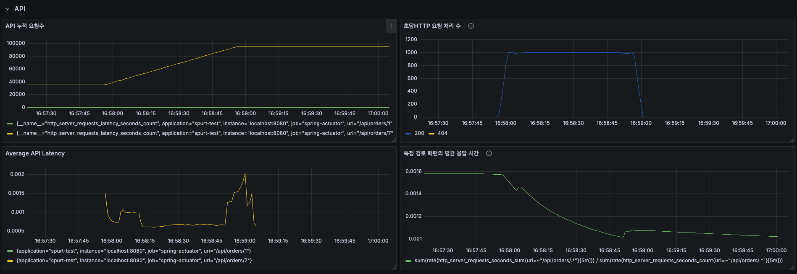
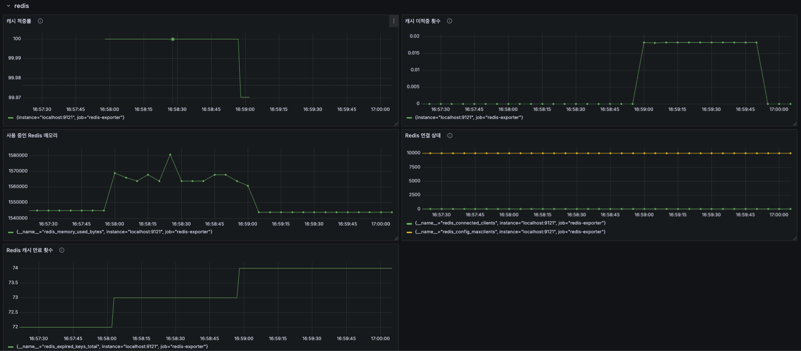

# Redis 캐시 및 K6 부하 테스트 결과 분석

## 1. 캐싱 전략 검증
| 목표: 자주 조회되는 데이터를 캐시로 처리하여 성능 개선 여부 확인.
### 1.1. 결과 기대 효과
1. 동일한 orderId 요청 시:
    - 첫 번째 요청: 데이터베이스에서 조회하고 캐시에 저장.
    - 이후 요청: 캐시에서 즉시 데이터 반환, DB 호출 없음.
2. 성능 개선:
    - DB 부하 감소.
    - 요청 처리 속도 개선.
3. 확장성:
    - 주문 상세 데이터 외 다른 엔드포인트에도 동일한 방식으로 캐싱 적용 가능.
### 1.2. 테스트 항목
1. 캐시 적중률:
    - 동일한 데이터를 여러 번 요청할 때 캐시 활용 비율 측정.
2. 캐시 만료 정책:
    - 캐시 데이터의 만료 시간이 성능에 미치는 영향 분석.
3. 캐시와 데이터 동기화:
    - DB와 캐시 간 데이터 불일치 상황에서의 처리 성능 확인.
- 해결 방안
    - Redis 같은 인메모리 캐시 사용.
    - 데이터 변경 이벤트 기반으로 캐시 동기화 설정.

## 2. 실행 개요
- **스크립트**: `script.js`
- **테스트 시나리오**:
  - 10개의 가상 사용자(VU, Virtual Users)가 1분 동안 루프를 실행
  - 30초의 Graceful Stop 기간 설정
- **테스트 목표**: `http://localhost:8080/api/orders/1`에 요청을 보내고 성능 데이터를 수집

---

## 3. 주요 결과
### 3.1. MVC

### 요청 처리 성능
- **총 요청 수**: 32,442건
- **성공 요청 수**: 32,424건 (99.95%)
- **실패 요청 수**: 18건 (0.05%)
- **평균 응답 시간**: 873.23µs (약 0.87ms)
- **최대 응답 시간**: 169.56ms
- **90번째 백분위수**: 1.35ms
- **95번째 백분위수**: 1.92ms

### 네트워크 데이터
- **수신된 데이터**: 24MB (초당 346kB)
- **전송된 데이터**: 3.6MB (초당 52kB)

### 요청 처리
- **총 요청 수**: 32,682
- **성공 요청 수**: 32,600 (99.75%)
- **실패 요청 수**: 82 (0.25%)
- **평균 요청 시간**: 4.08ms
- **최대 요청 시간**: 235.79ms
- **90백분위수 요청 시간**: 6.17ms
- **95백분위수 요청 시간**: 8.06ms

### 네트워크 데이터
- **수신된 데이터**: 24 MB (351 kB/s)
- **전송된 데이터**: 3.6 MB (53 kB/s)

### 연결 시간
- **차단 시간 (Blocked Time)**: 
  - **평균**: 31.39ms
  - **중앙값**: 62µs
  - **최대값**: 19.51s
  - **90백분위수**: 153µs
  - **95백분위수**: 214µs
- **연결 시간 (Connecting Time)**:
  - **평균**: 31.37ms
  - **중앙값**: 54µs
  - **최대값**: 19.51s
  - **90백분위수**: 134µs
  - **95백분위수**: 189µs

### HTTP 요청
- **수신 시간**:
  - **평균**: 65.89µs
  - **중앙값**: 18µs
  - **최대값**: 66.81ms
  - **90백분위수**: 87µs
  - **95백분위수**: 151µs
- **전송 시간**:
  - **평균**: 10.65µs
  - **중앙값**: 4µs
  - **최대값**: 1.71ms
  - **90백분위수**: 15µs
  - **95백분위수**: 27µs

### 가상 사용자 (VUs)
- **최소 VUs**: 1
- **최대 VUs**: 50

### 3.2. WEBFLUX

- **시나리오:** 초당 1,000 요청(`constant_rps` executor) 
- **테스트 기간:** 1분 (`duration: 1m0s`)
- **최대 VUs:** 100
- **요청 성공률:** **100%** (59851건 중 실패 없음)
- **총 요청 수:** **59,851**
- **평균 요청 응답 시간(`http_req_duration`):** **1.05ms**
- **데이터 전송량:**
  - **수신(`data_received`):** 35 MB
  - **송신(`data_sent`):** 5.5 MB

---

#### 3.2.1. 핵심 지표
| **지표**                    | **평균값** | **최소값** | **최댓값**     | **P90**      | **P95**      |
|-----------------------------|------------|------------|----------------|--------------|--------------|
| **응답 시간(`http_req_duration`)** | 1.05ms     | 254µs      | 172.64ms      | 1.44ms       | 2.1ms        |
| **요청 대기 시간(`http_req_waiting`)** | 1.01ms     | 231µs      | 172.39ms      | 1.4ms        | 2.05ms       |
| **요청 블로킹 시간(`http_req_blocked`)** | 5.08µs     | 0s         | 14.64ms       | 6µs          | 7µs          |
| **데이터 수신 시간(`http_req_receiving`)** | 26.68µs    | 4µs        | 8.59ms        | 44µs         | 53µs         |
| **데이터 송신 시간(`http_req_sending`)** | 13.33µs    | 1µs        | 9.12ms        | 20µs         | 23µs         |

---

#### 3.2.2 성공률
- **성공:** 100% (59,851 요청 중 0 실패)
- **Dropped Iterations:** 149건 (약 2.48%의 요청이 예상보다 높은 부하로 인해 처리되지 못함)

---

#### 3.2.3. 로드 분포
- **초당 요청 수(TPS):** 997.48/s
- **최대 활성 VUs(`vus_max`):** 49명
- **평균 요청 시간:** 1.05ms

---

#### 3.2.4. 문제점 및 개선 사항
1. **Dropped Iterations** (149건, 약 2.48%):
   - 일부 요청이 높은 부하로 인해 처리되지 못했음을 나타냅니다.
   - 원인 분석:
     - 서버의 연결 처리 제한 또는 네트워크 병목.
     - Redis, DB 등의 종속 서비스 응답 시간이 증가할 가능성.
   - **해결 방안:**
     - 서버의 연결 풀 크기 증가.
     - 종속 서비스(DB, Redis 등)의 성능 모니터링 및 최적화.
     - 백엔드 처리 시간 최적화.

2. **응답 시간 분포:**
   - `P95` 기준 2.1ms, `P90` 기준 1.44ms로, 대부분의 요청이 빠르게 처리.
   - 일부 요청은 최대 172ms로 처리되며, 이는 특정 서비스 병목이나 스파이크 부하로 인한 결과일 가능성이 있음.
   - **해결 방안:**
     - API 처리 시간을 줄이기 위한 DB 쿼리 최적화 및 캐싱 적용 검토.
     - 스파이크 부하를 위한 Auto-scaling 정책 적용 검토.

3. **Dropped Iterations가 일정 수준 이상 지속될 경우:**
   - `maxVUs`를 늘려 요청 처리 한도를 높이거나, 부하 테스트 스케줄을 수정해 점진적인 부하 증가를 테스트.

---

#### 3.2.5. 결론
- 서버는 **초당 1,000 요청(TPS)**을 안정적으로 처리하며, 성공률 100%를 기록.
- 일부 `Dropped Iterations`와 요청 지연은 고부하 상황에서의 병목현상 가능성을 시사.
- 종합적으로 성능은 양호하며, 향후 병목 지점(DB, 네트워크 등)을 정밀 모니터링하고 최적화 작업을 진행하면 더 나은 성능을 기대할 수 있습니다.

---

#### 3.2.6. 관찰 결과
1. **타임아웃 오류**:
   - 총 **82건의 요청이 `i/o timeout`** 으로 실패.
   - 서버의 동시 연결 처리 능력 부족 또는 네트워크 지연 문제가 원인일 가능성.

2. **요청 성능**:
   - **평균 요청 시간**(4.08ms)은 낮지만, **최대 요청 시간**(235.79ms)은 일부 요청에서 높은 지연이 발생했음을 의미.

3. **차단 및 연결 시간**:
   - `Blocked` 및 `Connecting` 시간에서 최대값(19.51s)이 나타나, 특정 요청이 심각한 지연을 겪었음을 알 수 있음.

4. **처리량(Throughput)**:
   - 시스템은 **초당 479.68 요청**을 처리하며, 높은 요청 처리 능력을 보여줌.

---

#### 3.2.7. 문제점 분석

### `dial: i/o timeout` 오류
- **오류 원인**:
  - `localhost:8080` 서버가 요청에 응답하지 못했거나, 과부하로 인해 연결 실패 발생.
  - 발생 가능성:
    - 서버가 실행되지 않음.
    - 서버가 과도한 부하로 인해 요청을 처리할 수 없었음.
    - 네트워크 구성 문제.

### HTTP 요청 실패 비율
- **결과**:
  - 총 32,442건의 요청 중 82건 실패.
  - 실패율: 0.05%로 매우 낮은 수준.
- **해석**:
  - 현재 요청량에서는 서버가 대부분의 요청을 잘 처리함.
  - 하지만 서버 부하가 증가할 경우 실패율 증가 가능.

### 응답 시간
- **평균 응답 시간**: 0.87ms로 매우 짧음.
- **최대 응답 시간**: 169.56ms로 특정 요청에서 지연 발생.

---

#### 3.2.8. 해결 방안

### 6.1. 확인 사항
  - `localhost:8080` 서버가 테스트 중 정상적으로 실행되었는지 확인.
  - 서버 로그를 검토하여 요청 처리 실패 원인 분석.

---

---

## 8. 결론
> 테스트 결과, 서버는 대부분의 요청을 안정적으로 처리했으나 일부 요청에서 `i/o timeout` 문제가 발생했습니다. 
> 추후 진행
---

### 8.1. 예상되는 병목 원인
**(1) Redis 캐시 활용률 문제**
- **낮은 캐시 적중률**: 캐시 데이터가 요청 키와 일치하지 않는 경우, Redis가 캐시 데이터를 제공하지 못하고 데이터베이스로 요청을 넘깁니다.
- **자주 발생하는 캐시 무효화**: 캐시 키가 올바르게 설정되지 않았거나 데이터가 빈번히 변경되어 캐시가 무효화되었습니다.
- **다양한 데이터 테스트**: 요청 데이터가 캐시되지 않은 경우가 많아 캐시 적중률이 낮아질 수 있습니다.

**(2) Redis 성능 병목**
- **Redis 서버 부하**: 높은 TPS(초당 트랜잭션)로 인해 Redis 응답 속도가 느려질 수 있습니다.
- **연결 풀 부족**: 제한된 Redis 연결로 인해 요청이 대기 상태에 빠질 수 있습니다.

**(3) 서버 병목 현상**
- **데이터베이스 호출 병목**: 캐시가 적중하지 않으면 데이터베이스 쿼리가 병목이 될 가능성이 있습니다.
- **애플리케이션 병목**: 비즈니스 로직이나 기타 I/O 작업이 병목을 유발할 수 있습니다.

**(4) 네트워크 문제**
- **네트워크 지연**: Redis와 API 서버 간 네트워크 속도가 느리거나 불안정할 경우 타임아웃이 발생할 수 있습니다.

## 9. Redis 캐시 타임아웃 문제 분석 및 해결
> 추후 진행

