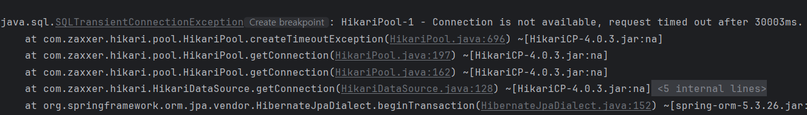

- [ ]  모놀리식 아키텍처 성능 테스트
- [ ]  마이크로서비스 아키텍처 구현
- [ ]  마이크로서비스 아키텍처에서의 성능 개선(네트워크)

# 1. 모놀리식 아키텍처

## 고민한 방안들

**1. 스냅샷 방식과 실시간 조회 방식을 혼합해서 구현하기**

   스냅샷 방식의 경우, 데이터 정합성 문제가 상대적으로 적고 조회 성능이 빠르다. BUT, 데이터가 변경되었을때 반영되지 않기 때문에 불변성을 유지하는 주문 내역이나 변경이 적은 시스템에 적합하다.

   따라서, 주문의 상품 정보, 지불 정보만 스냅샷으로 저장하고 나머지는 실시간으로 조회한다.

**2. 동시성 프로그래밍을 활용하기.**

   도메인 별, 비즈니스 로직이 분리되어 있을 때 동시성 프로그래밍을 사용해 성능과 응답 속도를 향상 시킬 수 있다.

   **🚨장점**

    - 도메인 별 데이터를 병렬로 가져오기 때문에 응답 시간이 단축된다.
    - CPU 코어를 활용하여 여러 작업을 동시에 실행한다.
    - 만약 새로운 도메인의 정보가 추가되더라도 동시성 작업만 추가하면 되기 때문에 확장이 쉽다.

### CompletableFuture를 사용한 비동기 프로그래밍을 구현하고 성능을 테스트해보자.
간단하게 도메인 별 서비스를 분리하지 않고 repository를 비동기로 실행하도록 아래처럼 구현했다.
``` java
public OrderDetailsResponse findOrderDetails(final Long orderId) throws ExecutionException, InterruptedException {
        Order order = orderRepository.findById(orderId)
                .orElseThrow(() -> new RuntimeException("Order not found"));

        CompletableFuture<List<Product>> productsFuture = CompletableFuture.supplyAsync(()-> productRepository.findByOrder(order));
        CompletableFuture<Delivery> deliveryFuture = CompletableFuture.supplyAsync(() -> deliveryRepository.findById(order.getDeliveryId())
                .orElseThrow(() -> new RuntimeException("Delivery not found")));
        CompletableFuture<Refund> refundFuture = CompletableFuture.supplyAsync(() -> refundRepository.findById(order.getRefundId())
                .orElseThrow(()-> new RuntimeException("Refund not found")));

        CompletableFuture.allOf(productsFuture, deliveryFuture, refundFuture).join();

        return new OrderDetailsResponse(productsFuture.get(), deliveryFuture.get(), refundFuture.get());
    }
```

아래 사진과 같이 DB timeout이 발생한다. pool 문제 인 것 같은데.. 
repository를 바로 불러오기 때문에 async를 적용할 부분도 없고 방법을 찾아보는 중..



# 기타) 관련 내용

## CompletableFuture를 통한 비동기 프로그래밍

### 1. 주요 기능

- 비동기 작업 실행: `runAsync()` , `supplyAsync()` 등의 메서드를 사용해 비동기 작업 실행 가능
- 작업 조합: `thenApply()` , `thenAccpet()` , `thenCompose()` , `thenCombine()` 등을 사용해 작업 결과를 처리 또는 조합할 수 있다.
- 예외 처리: `exceptionally()`, `handle()` 을 사용해 비동기 작업 중 발생한 예외를 처리한다.

### 2. 주의 사항

- 성능 측정: 병렬 처리가 항상 성능을 향상시키는 것이 아니기 때문에 실제로 성능이 개선되는지 확인해야 한다.
- 공유 상태? 상태 공유? 변경: completableFuture자체는 thread safe하지만, 내부에서 사용하는 로직이나 데이터가 공유 상태를 포함할 수 있기 때문에 변경하지 않도록 주의 해야 한다.
- 불변 객체나 thread safe한 컬렉션을 사용하는 것이 좋다.

함수형 프로그래밍을 통해 동시성을 관리하면 이런 코드의 복잡성과 상태 공유로 인한 동기화 문제를 최소화 할 수 있다.

<aside>
❓동시성과 비동기 용어 정리

- 동시성: 여러 작업을 동시에 처리하는 것처럼 보이게 하는 프로그래밍 방식
- 비동기: 작업의 완료 여부와 상관없이 다음 작업을 진행하는 방식
- 동기: 작업이 순차적으로 실행되는 방식
- 동기화: 여러 스레드가 공유 자원에 안전하게 접근하도록 실행 순서를 제어 하는 것
</aside>

### 3. 함수형 프로그래밍과 CompletableFuture간의 연결

**🚨함수형 프로그래밍의 핵심 개념**

- 순수 함수: 입력값만을 기반으로 결과를 계산하며, 외부 상태나 부작용(side
  effects)이 없다.
- 참조 투명성: 같은 입력에 대해 항상 같은 출력을 반환하는 성질 표현식을 그 결과 값으로 대체해도 프로그램의 동작이 변하지 않다.
- 불변성: 데이터가 생성된 이후 변경되지 않는 성질로, 상태 변화를 방지한다.

**🚨CompletableFuture와 함수형 프로그래밍의 연결**

CompletableFuture는 비동기 작업의 결과를 나타내는 컨테이너이다.

비동기 작업이 완료되면 결과 값을 포함하게 되며, 이후 이 값을 가지고 추가적인 처리를 진행하게 된다.

이때, 함수형 프로그래밍의 순수 함수를 사용하면 미래에 도착할 값에 대해 순수 함수를 적용하는 것이며, 이는 실제로 해당 값이 도착한 후 함수를 적용하는 결과와 동일하다.

```java
CompletableFuture<Integer> future = CompletableFuture.supplyAsync(() -> 5);
CompletableFuture<Integer> result = future.thenApply(x -> x * 2); //x -> x*2가 순수 함수
```

CompletableFuture(컨테이너)는 값이 도착하면 thenApply을 통해 순수함수가 적용된다.

⇒ 컨테이너 투명성으로 순수 함수는 컨테이너에 영향을 받지 않고 그저 컨테이너 내부의 값에만 의존한다.

⇒ 외부 상태나 스레드에 의존하지 않기 때문에 어느 스레드에서 실행되든 결과에 영향이 없어 동일한 결과가 나온다.

⇒ 순수 함수로 인한 동시성 프로그래밍에서 안전성을 줄 수 있다.