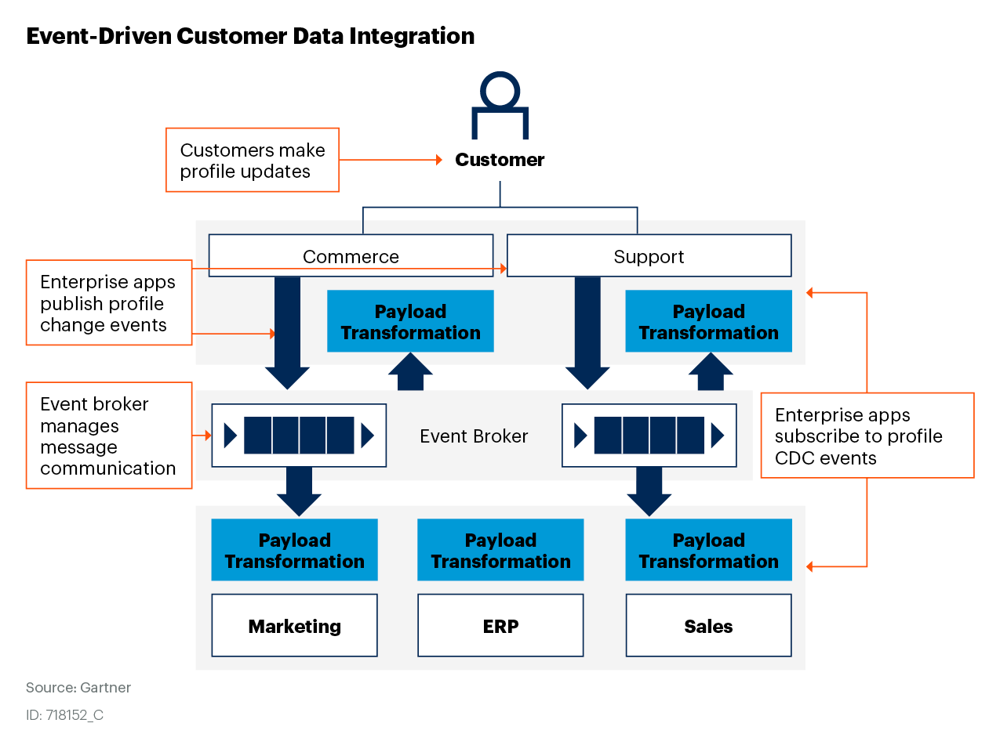
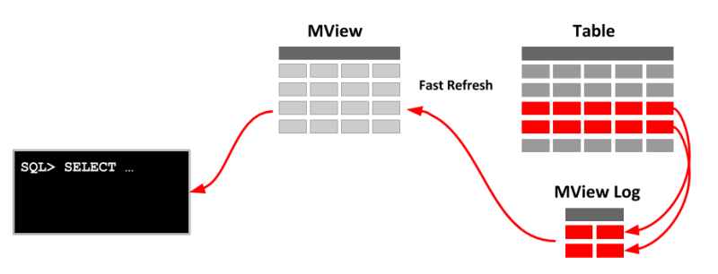

# MSA Aggregation을 위한 전략 분석

## 1. 동기화 전략

### 1.1. 동기화 방식을 선택할 때 고려 사항
1. **실시간성**:
    - 실시간 동기화가 중요하다면 **Replication** 또는 **이벤트 기반 동기화**를 채택.
    - 실시간성이 덜 중요하다면 **ETL 작업**이나 **Materialized View** 활용.
2. **데이터 구조**:
    - 읽기 성능을 최적화하기 위해 데이터 정규화를 해제하거나 집계를 적용하려면 **ETL 기반** 또는 **Materialized View**를 선택.
3. **운영 부하**:
    - **트리거**는 간단하지만 Source DB에 부하를 줄 수 있음.
    - **이벤트 기반 동기화**는 설정과 유지보수가 복잡할 수 있음.
4. **데이터 볼륨**:
    - 데이터 볼륨이 크다면 **배치 ETL**이나 **이벤트 스트림 기반 동기화**를 선호.

### 1.2. 정리
- **CQRS에서 RDB Read-only 테이블 동기화**는 시스템 요구사항에 따라 다양한 방식으로 구현할 수 있음.
  - **실시간 동기화**가 중요하면 **Replication**이나 **이벤트 기반 동기화**.
  - 데이터 구조를 변경하거나 주기적으로 동기화하려면 **ETL 작업**이나 **Materialized View**가 적합.

---

## 2. 채택 : 이벤트 기반 동기화(Event-Based Synchronization)

### 2.1. 동작 원리
- Source 데이터베이스에서 발생한 이벤트(INSERT, UPDATE, DELETE)를 **Kafka**, **RabbitMQ**, **Debezium**과 같은 메시지 브로커로 전송.
- 메시지를 수신한 후 **읽기 전용 테이블**에 데이터를 반영.

### 2.2. 특징
- 데이터 동기화를 **이벤트 스트림**으로 처리하므로 **실시간성**이 뛰어남.
- 복잡한 데이터 모델에서도 활용 가능.

### 2.3. 장점
- 최신 데이터를 실시간으로 유지.
- 분산 환경에서도 안정적으로 동작.

### 2.4. 단점
- 이벤트 처리 지연이 발생할 수 있음.
- 이벤트 처리 로직 개발과 유지보수에 대한 부담 증가.

### 2.5. 이벤트 기반 동기화 아키텍처
아래는 MSA 환경에서 이벤트 기반 동기화 아키텍처를 설명하는 다이어그램입니다.

>  출처 : https://solace.com/blog/gartner-event-driven-integration/

### 2.6. 데이터 동기화 흐름
| 단계               | 설명                                                                                                                                         |
|--------------------|--------------------------------------------------------------------------------------------------------------------------------------------|
| 1. 이벤트 캡처    | Source DB에서 INSERT, UPDATE, DELETE 이벤트를 CDC 도구를 통해 캡처.                                                                           |
| 2. 메시지 전송    | 캡처된 이벤트를 메시지 브로커(Kafka, RabbitMQ)를 통해 전송.                                                                                   |
| 3. 메시지 소비    | Query 서비스에서 메시지를 소비하고, 이벤트 데이터를 Read-only DB에 반영.                                                                     |
| 4. 최종 사용      | Read-only DB에 저장된 데이터를 기반으로 Aggregation을 수행하거나 고속 읽기 서비스를 제공.                                                      |

---

## 3. 채택 : Materialized View 활용(Materialized View Usage)

### 3.1. 특징
> 구체화 뷰라고도 불리는 오라클 Materialized View (MView) 뷰는 일반 View와는 달리 Data가 일정 공간을 차지하며 물리적으로 존재하는 테이블입니다. 어떠한 결과를 뽑아내는 쿼리가 너무나도 빈번히 사용될 경우, 쿼리 실행 시간의 수행 속도 향상을 위하여, 여러 가지의 Aggregate View를 두어, 미리 비용이 많이 드는 조인이나 Aggregate Operation을 처리하여야 하는 SQL을 위해, 데이터베이스의 한 테이블로 저장하며, 그 테이블을 조회하도록 하는 것입니다. 즉 집계 함수를 사용하는 대용량의 데이터를 처리하는 쿼리에 대해 수행 속도 향상을 위해, 쿼리의 결과만큼의 새로운 테이블을 생성해 놓는 방법입니다. 자주 사용되는 View의 결과를 디스크에 저장하여 쿼리 속도를 향상시키는 개념입니다.
- **Materialized View**는 데이터베이스의 쿼리 결과를 물리적으로 저장하는 **읽기 전용 테이블**.
- 주기적으로 또는 이벤트에 따라 데이터를 갱신(REFRESH).

> 출처 : oracle-base.com

### 3.2. 장점
- **읽기 성능 최적화**와 데이터 동기화를 동시에 처리.
- 데이터가 비정규화된 상태로 저장되므로 **쿼리 성능**이 빠름.

### 3.3. 단점
- 갱신 주기에 따라 **데이터 최신성**이 제한적일 수 있음.
- 데이터 갱신 작업 시 **비용**이 발생.

### 3.4. View와 Materialized View의 차이점

#### 3.4.1. 데이터 저장 방식
- **View**:
  - 가상의 테이블로, 뷰를 정의하는 쿼리가 실행될 때마다 실시간으로 결과가 생성됩니다.
  - 원본 테이블에 저장된 데이터는 별도로 저장되지 않습니다.
- **Materialized View**:
  - 실제로 데이터를 저장하는 테이블입니다.
  - 쿼리 결과가 사전에 계산되어 테이블에 저장되며, 데이터는 실시간으로 업데이트되지 않고 정적으로 유지됩니다.

---

#### 3.4.2. 데이터 접근 속도
- **View**:
  - 쿼리 실행 시 원본 테이블에 접근하여 데이터를 조회합니다.
  - 조회 속도는 원본 테이블의 성능에 영향을 받습니다.
- **Materialized View**:
  - 데이터를 사전에 계산하여 테이블에 저장하므로, 쿼리 실행 시 미리 계산된 결과를 바로 조회할 수 있습니다.
  - 매우 빠른 데이터 접근 속도를 제공합니다.

---

### 3.4.3. 업데이트 방식
- **View**:
  - 원본 테이블에 직접 접근하기 때문에, 원본 테이블에 발생하는 변경 사항이 즉시 반영됩니다.
- **Materialized View**:
  - 정적으로 데이터를 저장하기 때문에, 원본 테이블에 변경이 발생하면 해당 변경을 수동으로 반영해야 합니다.

## 3.5 Materialized View를 지원하는 주요 DBMS

1. **PostgreSQL**:
   - Materialized View를 내장하고 있으며, `CREATE MATERIALIZED VIEW` 문법을 사용하여 생성, 갱신, 삭제가 가능합니다.

2. **Oracle**:
   - `CREATE MATERIALIZED VIEW` 문을 사용하여 Materialized View를 생성할 수 있으며, `REFRESH` 명령을 통해 업데이트를 수행합니다.

3. **Microsoft SQL Server**:
   - SQL Server 2016부터 Materialized View 기능이 도입되었습니다.

4. **MySQL**:
   - MySQL은 기본적으로 Materialized View 기능을 내장하고 있지 않지만, 일부 확장 기능 또는 서드파티 플러그인을 통해 지원 가능합니다.

5. **Apache Cassandra**:
   - Materialized View를 기본적으로 지원하며, 분산 시스템에서 사용하기 적합합니다.

### 3.6. 데이터 갱신 흐름
| 단계              | 설명                                                                                                                              |
|-------------------|-----------------------------------------------------------------------------------------------------------------------------------|
| 1. 데이터 정리   | Source DB에서 필요한 데이터를 기반으로 Materialized View를 생성.                                                                    |
| 2. 정기적 갱신   | Materialized View를 주기적으로 갱신(자동 갱신 또는 수동 REFRESH).                                                                   |
| 3. 읽기 최적화   | Materialized View에 저장된 데이터를 기반으로 고속 쿼리 서비스 제공.                                                                  |
| 4. 최종 사용자   | 최적화된 데이터를 기반으로 Aggregation 처리 및 사용자 요청을 처리.                                                                   |

---

## 4. 이벤트 기반 동기화 vs Materialized View 비교

| 항목                    | 이벤트 기반 동기화                                      | Materialized View                                    |
|-------------------------|-------------------------------------------------------|----------------------------------------------------|
| **실시간성**            | 실시간 동기화 가능                                     | 주기적 갱신으로 실시간성 제한                      |
| **구현 복잡도**         | 이벤트 스트림 처리 로직이 필요                         | 데이터베이스에서 기본적으로 제공되는 기능 활용 가능 |
| **성능**                | 분산 환경에서 안정적인 동작                            | 단일 DB에서 읽기 성능 극대화                       |
| **데이터 최신성**        | 최신 상태 유지 가능                                    | 갱신 주기에 따라 다름                               |
| **운영 및 유지보수**    | 메시지 브로커와 이벤트 처리 로직 유지 필요              | Materialized View 갱신 전략 관리 필요               |
| **적용 환경**           | MSA 환경에서 적합                                     | 단일 서비스 환경에 적합                            |

> 추가중...