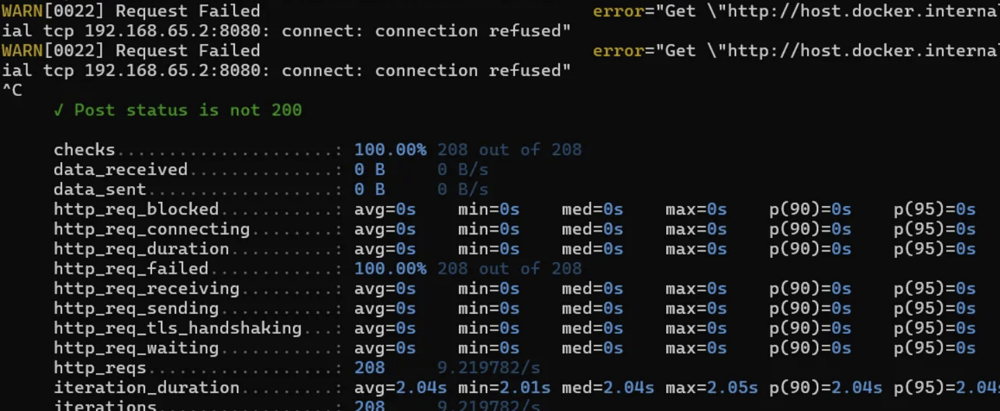
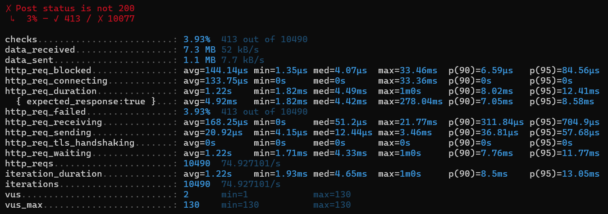
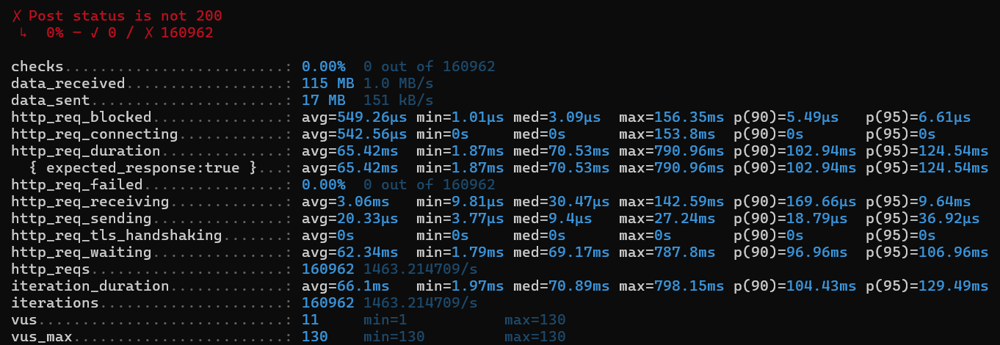
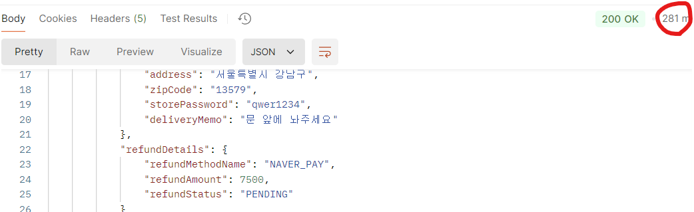
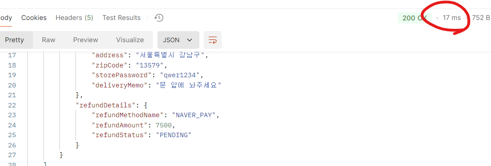
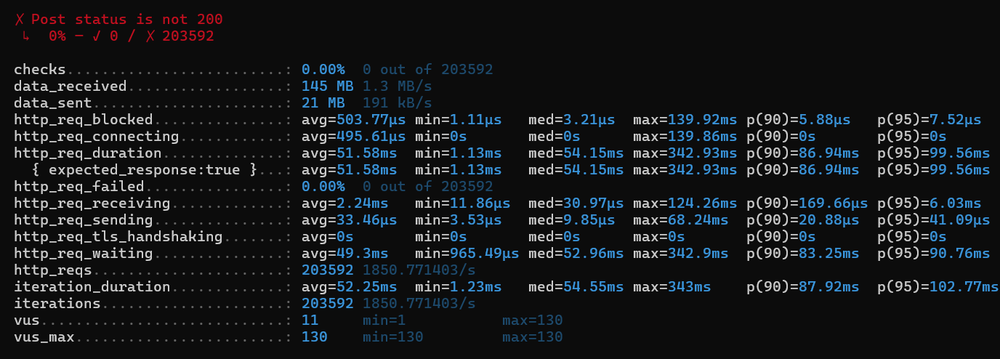

# 방안 1. completableFuture

completableFuture를 사용하기 위해 정의했던 Executor에 대한 동작 원리를 체크하지 않고 Vu 300(playground/k6_testing/week3/test1.js)으로 테스트를 진행했다.



그랬더니 시작부터 connection refused가 뜨면서 100%의 failed가 발생했다.

```java
@Configuration
@EnableAsync
public class AsyncConfig {

    @Bean(name = "customTaskExecutor")
    public Executor taskExecutor() {
        ThreadPoolTaskExecutor executor = new ThreadPoolTaskExecutor();
        executor.setCorePoolSize(10);
        executor.setMaxPoolSize(20);
        executor.setQueueCapacity(100);
        executor.setThreadNamePrefix("AsyncExecutor-");
        executor.initialize();
        return executor;
    }
```

내가 설정해준 Executor는 기본 스레드 10에 최대 20개이며 대기 큐는 100이기 때문에 앞의 작업이 끝나지 않았다는 것을 전제로 최대 130개의 요청이 처리되거나 대기한다.

그 이후의 요청은 처리되지 않거나, 실패하게 되기 때문에 Vu 300으로 성능테스트 한것은 거의 시작하자마자 바로 실패가 날 수밖에 없다.

그러면 내가 설정한 스레드 풀에 맞게 요청을 진행해보자.

아래와 같이 3.93%의 에러로 줄었다.



## Pool size

```bash
WARN 27740 --- [io-8080-exec-74] o.h.engine.jdbc.spi.SqlExceptionHelper   : SQL Error: 0, SQLState: null
ERROR 27740 --- [io-8080-exec-74] o.h.engine.jdbc.spi.SqlExceptionHelper   : **HikariPool-1 - Connection is not available, request timed out after 30015ms.**
```

3%의 failed를 줄여보고자 위 오류에 대해서 찾아보았다. 그 과정에서 아래 글을 보게 되었다.

https://techblog.woowahan.com/2664/

https://github.com/brettwooldridge/HikariCP/wiki/About-Pool-Sizing

Thread가 HikariPool에게 DB connection을 얻는 과정에서 문제가 발생하는 것이다.

`@Transactional`service 함수에서 connection을 하나 얻은 상태에서 더 얻으려고 할때, 다른 스레드에서 모든 DB connection을 점유한 상태라면 서로 wait를 하다가 30,000ms가 지나 Exception을 반환하게 된다.

### 해결 방법?

hikari의 `maximum-pool-size`를 1로 설정한 후 요청 1건을 실행했더니 connection timeout 에러가 발생했다.

내 코드의 경우 당연히 3개의 스레드에서 3개의 DB 연결을 하기 때문에 connection 에러가 발생할 수 밖에 없다.

```bash
pool size = Tn x (Cm - 1) + 1
```

- Tn: 최대 스레드 개수
- Cm: 하나의 스레드에서 동시에 필요한 connection 수

이에 따라 Executor 스레드 개수는 최대 20개, 하나의 스레드에서 필요한 커넥션은 3개로 20*(3-1)+1 = 41개이다.

이게 최소한의 pool size이다.

이에 맞춰서 `hikari:  minimum-idle: 41  maximum-pool-size: 200` 로 설정하고 성능 테스트를 수행해봤다.

Vu130으로 진행했을 때 3%의 failed 발생이 0%으로 줄은 것을 확인할 수 있다.


# 방안 2. 캐시 적용

캐시는 로컬 캐시, 글로벌 캐시가 있다. 말그대로 별도의 캐시 서버를 사용하는 것이 글로벌 캐시, 동일한 서버의 리소스를 사용하는 것이 로컬 캐시이다.

## 1. 로컬 캐시 사용하기

caffeine과 ehcache가 가장 많이 사용되는 로컬 캐시이다.

현재는 단순 캐시를 저장하고 조회를 하면되기 때문에 캐시 성능면에서 뛰어난 caffeine cache를 적용해보려고 한다. (이후, ehcache와 비교해보면 좋을 듯)

완전 단순하게 caffeine으로 cacheManger를 설정하고 orderId를 key로 설정한다.
아래와 같이 처음 요청은 281ms이었으나, 다시 요청하니 17ms로 확 줄은 것을 볼 수 있다.




똑같은 k6 스크립트(vu 130)으로 테스트해봤을때, 캐시를 적용하기 전보다 평균 10ms이 줄은 것을 확인할 수 있다.


