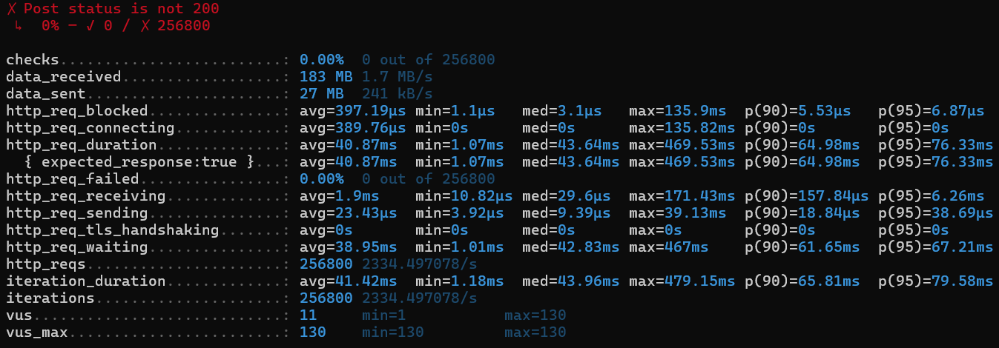
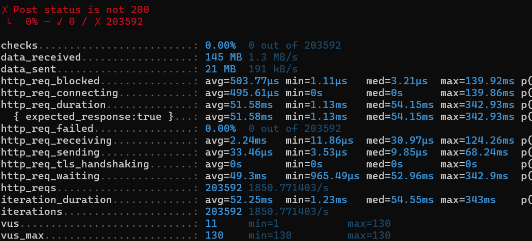
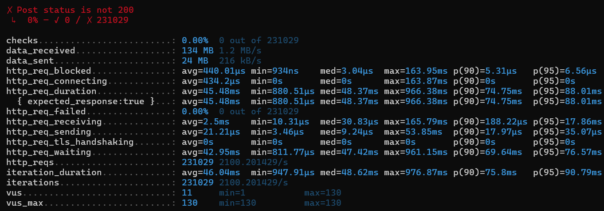
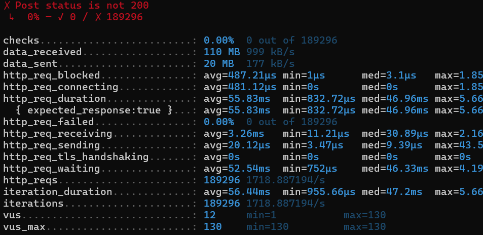

## LocalCache 성능 비교

https://github.com/ben-manes/caffeine/wiki/Benchmarks 이 글을 보면 caffeine cache에서 작성한 글로 ehcache와 성능 비교를 하고 있다.

해당 글만 보면 단순히 값을 임시 저장, 조회하는 용도로 사용한다면 caffeine의 성능이 압도적으로 좋게 보인다.

그래서 단순하게 캐시 관련하여 정책이나 다른 설정 없이 캐시를 저장하고 조회했을 때 성능의 차이가 있을지 확인을 해보고 싶었다.

<aside>
💡

**ehcache 도입 트러블 슈팅**

ehcache 버전 2, 3는 설정 하는 방식이 조금 다르다.

이걸 모르고 그냥 적용하다가 꽤 오래동안 붙잡고 있었다.

- ehcache 버전 2의 경우 net.sf.ehcache:ehcache이며
- ehcache 버전 3은 org.ehcache:ehcache로 시작한다.

</aside>

아래가 ehcache의 결과이며 receivin 평균이 1.9ms이고

지난 번의 caffeine의 결과는 2.24ms이다. 

벤치마크 글과 달리 ehcache가 더 빠르게 나왔다.

성능 테스트를 돌릴 때 캐시를 한번 저장하고 계속 똑같은 인덱스를 조회하기 때문인 것인지, 너무 단순하게 진행해서 인지....?

### 그렇다면 caffeine이 좋은 점을 찾아보고 이를 구현해보자.

1. window TinyLFU 알고리즘을 사용
2. 비동기 데이터 로딩을 지원
3. JVM 내부에 최적화되어 있음

   `concurrentHashMap` 기반의 설계로 데이터 접근 및 삽입이 매우 빠르고 락 경합이 최소화되어 있다.

⇒ Ehcache는 분산환경, 디스크 저장에 유리하지만 caffeine은 단일 JVM 환경에서 유리하다.

특히 window TinyLFU를 사용한 캐시 제거 부분이 우월하다고 한다.

결국 caffeine과 ehcache의 캐시 제거가 발생할 수 있도록 많은 데이터를 삽입하고 조회하는 방식으로 성능 테스트를 진행해야 한다.

### 1. 프로시저로 데이터를 대량 삽입하기
mysql DB를 기준으로 대량 데이터를 생성할 수 있는 프로시저 
100개 데이터 생성 후
1. ehcache receiving 2.5ms

2. caffeine cache 3.26ms

마찬가지로 ehcache가 더 빠르다.