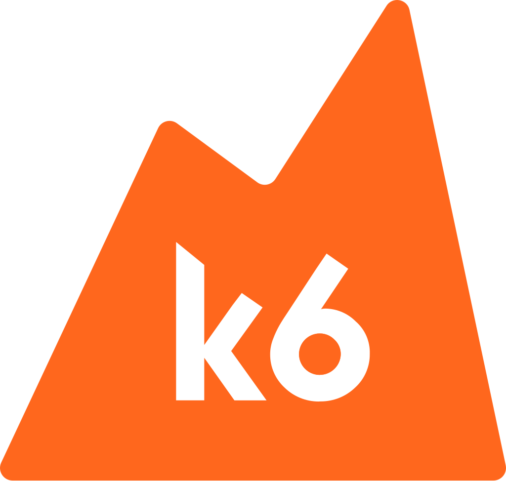
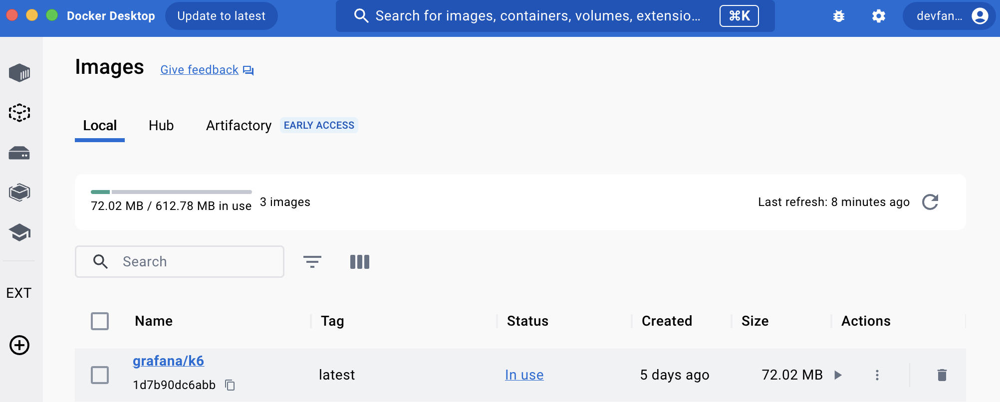

## K6

### K6 소개



장점

* Grafana에서 만든 오픈소스 부하생성 도구

* 쉬운 테스트 수행, 개발자 중심의 성능 테스트 가능

* CLI 툴을 이용하여 개발자 친화적인 API 제공

  > 명령 줄 인터페이스(CLI, Command line interface) 또는 명령어 인터페이스는 텍스트 터미널을 통해 사용자와 컴퓨터가 상호 작용하는 방식을 뜻한다. 즉, 작업 명령은 사용자가 컴퓨터 키보드 등을 통해 문자열의 형태로 입력하며, 컴퓨터로부터의 출력 역시 문자열의 형태로 주어진다. ( - 위키백과 - )


* 자바 스크립트 ES6 지원

* 자동화 pipeline 구성 가능

단점

* 브라우저 지원 안됨, CLI 도구

* NodeJS 환경에서 수행 안됨

### 기본 구조(life cycle)

* k6는 여러개의 단계로 실행이 된다.

* 스테이지는 항상 동일한 순서로 실행된다.

```js
// 1. init code

export function setup() {
  // 2. setup code
}

export default function (data) {
  // 3. VU code
}

export function teardown(data) {
  // 4. teardown code
}
```

1. init 는 스크립트를 초기화 한다. (파일로드, 모듈 임포트, 함수 정의 등)
2. (선택사항) setup코드는 환경을 준비하고, 데이터를 생성한다.
3. VU코드는 default 함수에서 수행된다. 실제로 테스트 요청을 보내는 코드가 작성된다. 옵션에 정의한 만큼 반복 동작한다.
4. (선택사항) teardown 함수는 테스트의 환경을 정리하고, 자원을 릴리즈한다.

### Quick Start

> [Install K6](https://grafana.com/docs/k6/latest/set-up/install-k6/)
>
> 아래는 Mac OS 기준으로 작성했습니다.

```bash
brew install k6
```

그런 다음, docker 명령어를 입력한다.

```bash
docker pull grafana/k6
```

Docker Desktop를 통해 Local 에서 `grafana/k6` 이미지가 있는지 확인한다.



> 아래 부터는 해당 [[깃허브] spring-performance](https://github.com/devFancy/KoJaPlayground/tree/main/spring-performance) 기준으로 작성했습니다.

k6-scripts 폴더에 있는 first_scripts.js 를 아래와 같이 작성한다.

```js
import http from 'k6/http';
import { sleep } from 'k6';

export default function () {
    http.get('https://test.k6.io');
    sleep(1);
}
```

위 테스트 코드는 http://test.k6.io 에 get 요청을 보내고, 1초 쉬게 된다.

그런 다음, 해당 터미널에서 k6를 실행한다. (명령어 실행할 때의 위치: spring-performance/k6-scripts)

```bash
k6 run first_scripts.js
```

그러면 아래와 같이 실행 결과가 나온다.

```bash
$ k6-scripts % k6 run first_scripts.js

         /\      Grafana   /‾‾/  
    /\  /  \     |\  __   /  /   
   /  \/    \    | |/ /  /   ‾‾\ 
  /          \   |   (  |  (‾)  |
 / __________ \  |_|\_\  \_____/ 

     execution: local
        script: first_scripts.js
        output: -

     scenarios: (100.00%) 1 scenario, 1 max VUs, 10m30s max duration (incl. graceful stop):
              * default: 1 iterations for each of 1 VUs (maxDuration: 10m0s, gracefulStop: 30s)


     data_received..................: 17 kB 11 kB/s
     data_sent......................: 442 B 273 B/s
     http_req_blocked...............: avg=427.77ms min=427.77ms med=427.77ms max=427.77ms p(90)=427.77ms p(95)=427.77ms
     http_req_connecting............: avg=186.9ms  min=186.9ms  med=186.9ms  max=186.9ms  p(90)=186.9ms  p(95)=186.9ms 
     http_req_duration..............: avg=184.51ms min=184.51ms med=184.51ms max=184.51ms p(90)=184.51ms p(95)=184.51ms
       { expected_response:true }...: avg=184.51ms min=184.51ms med=184.51ms max=184.51ms p(90)=184.51ms p(95)=184.51ms
     http_req_failed................: 0.00% 0 out of 1
     http_req_receiving.............: avg=79µs     min=79µs     med=79µs     max=79µs     p(90)=79µs     p(95)=79µs    
     http_req_sending...............: avg=402µs    min=402µs    med=402µs    max=402µs    p(90)=402µs    p(95)=402µs   
     http_req_tls_handshaking.......: avg=191.27ms min=191.27ms med=191.27ms max=191.27ms p(90)=191.27ms p(95)=191.27ms
     http_req_waiting...............: avg=184.03ms min=184.03ms med=184.03ms max=184.03ms p(90)=184.03ms p(95)=184.03ms
     http_reqs......................: 1     0.618512/s
     iteration_duration.............: avg=1.61s    min=1.61s    med=1.61s    max=1.61s    p(90)=1.61s    p(95)=1.61s   
     iterations.....................: 1     0.618512/s
     vus............................: 1     min=1      max=1
     vus_max........................: 1     min=1      max=1


running (00m01.6s), 0/1 VUs, 1 complete and 0 interrupted iterations
default ✓ [======================================] 1 VUs  00m01.6s/10m0s  1/1 iters, 1 per VU
```

아래는 k6의 실행 결과를 설명하는 표이다. k6는 기본 내장 메트릭과 HTTP 요청 시 생성되는 메트릭으로 구분할 수 있다.

> 자세한 내용은 공식문서의 [Built-in metrics](https://grafana.com/docs/k6/latest/using-k6/metrics/reference/#built-in-metrics) 를 참고하면 됩니다.

| Metric Name                | Description                                                                         |
| -------------------------- | ----------------------------------------------------------------------------------- |
| `data_received`            | 수신된 데이터의 양                                                                  |
| `data_sent`                | 전송된 데이터의 양                                                                  |
| `http_req_blocked`         | 요청을 시작하기 전에 TCP 연결 슬롯을 기다리며 차단된 시간                           |
| `http_req_connecting`      | 원격 호스트에 TCP 연결을 설정하는 데 걸린 시간                                      |
| `http_req_duration`        | 요청에 걸린 총 시간 (http_req_sending + http_req_waiting + http_req_receiving의 합) |
| `http_req_failed`          | setResponseCallback에 따라 실패한 요청의 비율                                       |
| `http_req_receiving`       | 원격 호스트로부터 응답 데이터를 받는 데 걸린 시간                                   |
| `http_req_sending`         | 원격 호스트에 데이터를 보내는 데 걸린 시간                                          |
| `http_req_tls_handshaking` | 원격 호스트와 TLS 세션을 핸드셰이킹하는 데 걸린 시간                                |
| `http_req_waiting`         | 원격 호스트로부터 응답을 기다리는 데 걸린 시간                                      |
| `http_reqs`                | k6가 생성한 총 HTTP 요청 수                                                         |
| `iteration_duration`       | VU가 JS 스크립트(기본 함수)를 실행한 총 횟수                                        |
| `iterations`               | 반복의 총 수 및 초당 반복 수                                                        |
| `vus`                      | 현재 활성 가상 사용자의 수                                                          |
| `vus_max`                  | 가능한 최대 가상 사용자 수                                                          |

## 궁금한 점들(QA)

> 아래는 [23년 2월 Tech 세미나 - 성능 테스트와 K6 도구 소개](https://www.youtube.com/live/MqdQc4vd_ws) 영상에서 Q&A (1:26 ~) 부분에 대해 정리한 내용입니다.

* 다른 도구와 비교했을 때 장점 -> UI가 없어서 command로 해야함 -> CI/CD, 테스트 자동화 하기가 편함

    * K6 이용하면 자동화는 편하고, 1대만 설치해도 왠만한 워크로드 돌릴 수 있음

* K6에 대한 관심도 수준

```markdown
github에 stars 갯수를 바탕으로 인기를 확인하면 아래와 같다.

(출처: https://testguild.com/load-testing-tools/)

2024.11.16 기준
- k6: 26k stars
- JMeter: 8.4k stars
- Locust: 25.1k stars
- nGrinder: 2k stars
- Gatling: 6.5k stars 
- Tsung: 2.5k stars
- Siege: 6k stars
```

* 인프라/네트워크/애플리케이션 측면에서 GUI 기반으로 사용이 간편한지 -> K6는 성능 테스트를 위한 부하 발생기일 뿐,
  Datadog 이나 Cloudwatch 같은 걸 봐야함. pin point를 활용하면 좋을 것 같음

* Grafana 생태계와 시너지가 기대되는데, 다른 부하테스트 도구들과 비교했을 때 어떤 장점이 있는지, 결과를 시각화할 수 있는지
  -> K6를 위한 대시보드가 이미 만들어져 있음. 이미 Grafana 생태계에 통합이 되어 있음. 직접 포워드로 작성하는게 문제가 됨

* 사용자 Think Time은 어떤 기준으로 설정하는지? -> 성능 테스트하는 분이 설정만 하는건지, 답은 존재하지 않음

* K6 성능 테스트 도구를 활용하면 좋을 비즈니스 도메인은 어디인지 궁금 -> 어디서나 가리진 않음. 프로토콜에 따라 다를 것 같음
  이 도구의 장점을 극대화할 수 있는지 -> 로컬에서, EC2 1개에서 가능하나, 워크로드 모델링을 하고, 가설로 잡은 TPS가 나오느냐가 최대로 활용하는 방법

* 이노릭스DB 말고 다른 mysql db를 사용할 수 있는지 -> mysql db를 사용할 수 있는지는 사이트 들어가서 확인해야 함.

* 대규모 사용시 OS 튜닝하면 된다고 하셨는데, k6 구동되는 서버의 메모리,CPU를 최대한 효율적으로 사용하는 구조 -> 맞다. 튜닝해서 하면 최대한 효율적으로 사용할 수 있음

## Review

* K6에 대한 기본 개념에 대한 설명이 많기 때문에, 이 부분에 대해서는 추가적으로 더 조사해서 정리해봐야겠다.

* 추가적으로 메트릭 수집 및 모니터링 도구인 `Prometheus`, 데이터 소스를 시각화할 수 있는 대시보드 도구인 `Grafana` 에 대해서도 공부해서 정리해봐야겠다.

* 중요한 건 실습 예제를 직접 만들어 보면서 K6, Prometheus, Grafana 도구를 사용해야 더 이해가 와닿을 것 같다.

## Reference

* [23년 2월 Tech 세미나 - 성능 테스트와 K6 도구 소개](https://www.youtube.com/live/MqdQc4vd_ws)

* [[Github] K6 도구 소개](https://github.com/schooldevops/k6-tutorials/blob/main/UsingK6/99_K6_Seminar.md)

* [[공식문서] What is Grafana k6? ](https://grafana.com/oss/k6/)

* [[공식문서] Install k6](https://grafana.com/docs/k6/latest/set-up/install-k6/)

* [[Github] Using K6 - Test life cycle](https://github.com/schooldevops/k6-tutorials/blob/main/UsingK6/06_test_lifecycle.md)

* [[공식문서] Using k6 - Metrics - Built-in metrics](https://grafana.com/docs/k6/latest/using-k6/metrics/reference/#built-in-metrics)