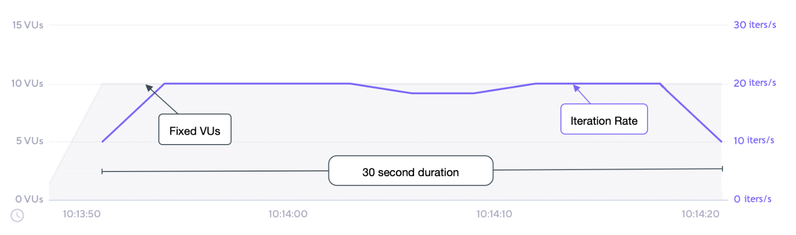

## K6

### K6 소개


> 장점

* Grafana에서 만든 오픈소스 부하생성 도구

* 쉬운 테스트 수행, 개발자 중심의 성능 테스트 가능

* CLI 툴을 이용하여 개발자 친화적인 API 제공

  > 명령 줄 인터페이스(CLI, Command line interface) 또는 명령어 인터페이스는 텍스트 터미널을 통해 사용자와 컴퓨터가 상호 작용하는 방식을 뜻한다. 즉, 작업 명령은 사용자가 컴퓨터 키보드 등을 통해 문자열의 형태로 입력하며, 컴퓨터로부터의 출력 역시 문자열의 형태로 주어진다. ( - 위키백과 - )


* 자바 스크립트 ES6 지원

* 자동화 pipeline 구성 가능

> 단점

* 브라우저 지원 안됨, CLI 도구

* NodeJS 환경에서 수행 안됨

### 기본 구조(life cycle)

* k6는 여러개의 단계로 실행이 된다.

* 스테이지는 항상 동일한 순서로 실행된다.

```js
// 1. init code

export function setup() {
  // 2. setup code
}

export default function (data) {
  // 3. VU code
}

export function teardown(data) {
  // 4. teardown code
}
```

1. init 는 스크립트를 초기화 한다. (파일로드, 모듈 임포트, 함수 정의 등)
2. (선택사항) setup코드는 환경을 준비하고, 데이터를 생성한다.
3. VU코드는 default 함수에서 수행된다. 실제로 테스트 요청을 보내는 코드가 작성된다. 옵션에 정의한 만큼 반복 동작한다.
4. (선택사항) teardown 함수는 테스트의 환경을 정리하고, 자원을 릴리즈한다.

### Quick Start

> [Install K6](https://grafana.com/docs/k6/latest/set-up/install-k6/)
>
> 아래는 Mac OS 기준으로 작성했습니다.

```bash
brew install k6
```

그런 다음, docker 명령어를 입력한다.

```bash
docker pull grafana/k6
```

Docker Desktop를 통해 Local 에서 `grafana/k6` 이미지가 있는지 확인한다.


> 아래 부터는 해당 [[깃허브] spring-performance](https://github.com/devFancy/KoJaPlayground/tree/main/spring-performance) 기준으로 작성했습니다.

k6-scripts 폴더에 있는 first_scripts.js 를 아래와 같이 작성한다.

```js
import http from 'k6/http';
import { sleep } from 'k6';

export default function () {
    http.get('https://test.k6.io');
    sleep(1);
}
```

위 테스트 코드는 http://test.k6.io 에 get 요청을 보내고, 1초 쉬게 된다.

그런 다음, 해당 터미널에서 k6를 실행한다. (명령어 실행할 때의 위치: spring-performance/k6-scripts)

```bash
k6 run first_scripts.js
```

그러면 아래와 같이 실행 결과가 나온다.

```bash
$ k6-scripts % k6 run first_scripts.js

         /\      Grafana   /‾‾/  
    /\  /  \     |\  __   /  /   
   /  \/    \    | |/ /  /   ‾‾\ 
  /          \   |   (  |  (‾)  |
 / __________ \  |_|\_\  \_____/ 

     execution: local
        script: first_scripts.js
        output: -

     scenarios: (100.00%) 1 scenario, 1 max VUs, 10m30s max duration (incl. graceful stop):
              * default: 1 iterations for each of 1 VUs (maxDuration: 10m0s, gracefulStop: 30s)


     data_received..................: 17 kB 11 kB/s
     data_sent......................: 442 B 273 B/s
     http_req_blocked...............: avg=427.77ms min=427.77ms med=427.77ms max=427.77ms p(90)=427.77ms p(95)=427.77ms
     http_req_connecting............: avg=186.9ms  min=186.9ms  med=186.9ms  max=186.9ms  p(90)=186.9ms  p(95)=186.9ms 
     http_req_duration..............: avg=184.51ms min=184.51ms med=184.51ms max=184.51ms p(90)=184.51ms p(95)=184.51ms
       { expected_response:true }...: avg=184.51ms min=184.51ms med=184.51ms max=184.51ms p(90)=184.51ms p(95)=184.51ms
     http_req_failed................: 0.00% 0 out of 1
     http_req_receiving.............: avg=79µs     min=79µs     med=79µs     max=79µs     p(90)=79µs     p(95)=79µs    
     http_req_sending...............: avg=402µs    min=402µs    med=402µs    max=402µs    p(90)=402µs    p(95)=402µs   
     http_req_tls_handshaking.......: avg=191.27ms min=191.27ms med=191.27ms max=191.27ms p(90)=191.27ms p(95)=191.27ms
     http_req_waiting...............: avg=184.03ms min=184.03ms med=184.03ms max=184.03ms p(90)=184.03ms p(95)=184.03ms
     http_reqs......................: 1     0.618512/s
     iteration_duration.............: avg=1.61s    min=1.61s    med=1.61s    max=1.61s    p(90)=1.61s    p(95)=1.61s   
     iterations.....................: 1     0.618512/s
     vus............................: 1     min=1      max=1
     vus_max........................: 1     min=1      max=1


running (00m01.6s), 0/1 VUs, 1 complete and 0 interrupted iterations
default ✓ [======================================] 1 VUs  00m01.6s/10m0s  1/1 iters, 1 per VU
```

### Metrics

메트릭은 시스템이 테스트 조건에서 어떻게 수행되는지를 측정한다. 기본적으로 k6는 내장 메트릭을 자동으로 수집한다. 내장 메트릭 외에도 사용자 정의 메트릭을 만들 수도 있다.

메트릭은 네 가지 주요 유형으로 나뉜다.

* `카운터(Counters)`: 값을 합산한다. (누적값을 의미한다)

* `게이지(Gauges)`: 가장 작은 값, 가장 큰 값, 그리고 최신 값을 추적한다.

* `비율(Rates)`: 0이 아닌 값이 얼마나 자주 발생하는지를 추적한다.

* `트렌드(Trends)`: 여러 값에 대한 통계(예: 평균, 최빈값 또는 백분위수)를 계산한다.

아래는 k6의 실행 결과를 설명하는 표이다. k6는 기본 내장 메트릭과 HTTP 요청 시 생성되는 메트릭으로 구분할 수 있다.

> 자세한 내용은 공식문서의 [Built-in metrics](https://grafana.com/docs/k6/latest/using-k6/metrics/reference/#built-in-metrics) 를 참고하면 됩니다.

| Metric Name                | Description                                                                         |
| -------------------------- | ----------------------------------------------------------------------------------- |
| `data_received`            | 수신된 데이터의 양                                                                  |
| `data_sent`                | 전송된 데이터의 양                                                                  |
| `http_req_blocked`         | 요청을 시작하기 전에 TCP 연결 슬롯을 기다리며 차단된 시간                           |
| `http_req_connecting`      | 원격 호스트에 TCP 연결을 설정하는 데 걸린 시간                                      |
| `http_req_duration`        | 요청에 걸린 총 시간 (http_req_sending + http_req_waiting + http_req_receiving의 합) |
| `http_req_failed`          | setResponseCallback에 따라 실패한 요청의 비율                                       |
| `http_req_receiving`       | 원격 호스트로부터 응답 데이터를 받는 데 걸린 시간                                   |
| `http_req_sending`         | 원격 호스트에 데이터를 보내는 데 걸린 시간                                          |
| `http_req_tls_handshaking` | 원격 호스트와 TLS 세션을 핸드셰이킹하는 데 걸린 시간                                |
| `http_req_waiting`         | 원격 호스트로부터 응답을 기다리는 데 걸린 시간                                      |
| `http_reqs`                | k6가 생성한 총 HTTP 요청 수                                                         |
| `iteration_duration`       | VU가 JS 스크립트(기본 함수)를 실행한 총 횟수                                        |
| `iterations`               | 반복의 총 수 및 초당 반복 수                                                        |
| `vus`                      | 현재 활성 가상 사용자의 수                                                          |
| `vus_max`                  | 가능한 최대 가상 사용자 수                                                          |

## Scenarios

> 시나리오에 대한 자세한 설명이 궁금하다면, [23년 2월 Tech 세미나 - 성능 테스트와 K6 도구 소개](https://www.youtube.com/live/MqdQc4vd_ws) 영상에서 50:00부터 보시면 됩니다.

K6는 다양한 테스트 환경을 지원하기 위해 시나리오 라는 개념을 두고 있다.

여기서 시나리오는 VU(가상 사용자)와 iteration schdules(반복 스케줄링)를 세부적으로 구성할 수 있다.

시나리오를 사용하면 다양한 워크로드 혹은 traffic pattern을 부하 테스트에서 모델링 할 수 있다.

시나리오를 사용할 때의 이점은 아래와 같다.

* **더 쉬운 테스트 구성**: 하나의 스크립트에 **여러 시나리오를 선언**할 수 있고, **각각 독립적**으로 다른 JavaScript 함수를 실행할 수 있다.

* **현실적인 트래픽 시뮬레이션**: 각 시나리오는 목적에 맞게 설계된 실행자를 사용하여 고유한 VU 및 반복 스케줄링 패턴을 적용할 수 있다.

* **병렬 또는 순차적 워크 로드(workloads)**: 시나리오는 서로 독립적이기 때문에 병렬로 실행되지만, 각 시나리오의 `startTime` 속성을 신중히 설정하여 순차적으로 실행되는 것처럼 보이게 만들 수도 있다.

* **세부적인 결과 분석**: 각 시나리오에 대해 서로 다른 환경 변수와 메트릭 태그를 설정할 수 있다.

### Configure scenarios

시나리오를 구성하려면 `options` 객체가 `scenarios` 키를 사용한다.

스크립트 내의 각 시나리오 이름은 **고유** 해야 하며, 원하는 이름을 지정할 수 있다.

시나리오 이름은 결과 요약, 태그 등에서 표시된다.

```js
export const options = {
  scenarios: {
    example_scenario: {
      // name of the executor to use(사용할 실행자의 이름)
      executor: 'shared-iterations',

      // common scenario configuration(공통 시나리오 구성)
      startTime: '10s',
      gracefulStop: '5s',
      env: { EXAMPLEVAR: 'testing' },
      tags: { example_tag: 'testing' },

      // executor-specific configuration(실행자별 구성)
      vus: 10,
      iterations: 200,
      maxDuration: '10s',
    },
    another_scenario: {
      /*...*/
    },
  },
};
```

### Scenario executors

각 k6 시나리오에 대해 VU 워크로드는 실행자가 스케줄링한다.

실행자는 테스트가 얼마나 오래 실행될지, 트래픽이 일정하게 유지될지 아니면, 변화할지를 설정하며,

워크로드가 VU에 의해 모델링될지 또는 arrival rate에 의해 모델링될지를 결정한다.

시나리오 객체는 반드시 `executor` 속성을 **미리 정의된 실행자 이름 중 하나로 설정**해야 한다.

선택한 실행자에 따라 k6가 부하를 모델링하는 방식이 결정된다. 선택 사항은 다음과 같다.

* 반복 횟수 기준

  * `shared-iterations`: VU들 사이에서 반복을 공유한다.

  * `per-vu-iterations`: 각 VU가 설정된 반복을 실행한다.

* VU(가상 사용자) 수 기준

  * `constant-VUs`: 일정한 수의 VU를 보낸다. -> **일반적으로 TPS 측정**할 때 사용하는 executors

  * `ramping-vus`: 설정된 단계에 따라 VU의 수를 점진적으로 증가시킨다.


* 반복 속도 기준

  * `constant-arrival-rate`: 반복을 일정한 속도로 시작한다.

  * `ramping-arrival-rate`: 설정된 단계에 따라 반복 속도를 점진적으로 증가시킨다.

각 실행자 객체는 일반적인 시나리오 옵션 외에도 워크 로드에 특화된 추가 옵션을 가진다.

(전체 옵션 목록은 [Executors](https://grafana.com/docs/k6/latest/using-k6/scenarios/executors/) 섹션을 참조하시면 됩니다)

### Scenario options

아래와 같이 시나리오를 구성하면 다양한 부하 테스트를 세부적으로 조정할 수 있다.

| 옵션               | 유형      | 설명                                                                 | 기본값   |
| ------------------- | --------- | ------------------------------------------------------------------- | -------- |
| `executor` (필수)   | 문자열    | 고유한 실행자 이름. 가능한 값은 실행자 섹션에서 확인할 수 있다.         | -        |
| `startTime`         | 문자열    | 테스트 시작 후 이 시나리오가 실행될 시점의 시간 오프셋이다.               | "0s"     |
| `gracefulStop`      | 문자열    | 반복을 강제 종료하기 전에 완료될 때까지 기다리는 시간이다. 자세한 내용은 "Graceful stop"을 참고하라. | "30s"    |
| `exec`              | 문자열    | 실행할 내보낸 JS 함수의 이름이다.                                      | "default"|
| `env`               | 객체      | 이 시나리오에 특정한 환경 변수다.                                      | {}       |
| `tags`              | 객체      | 이 시나리오에 특정한 태그다.                                           | {}       |
| `options`           | 객체      | 브라우저 옵션을 포함한 추가 옵션이다.                                  | {}       |

### Constant VUs

여러 실행자 중 성능 테스트 때 **가장 많이 사용하는 `Constant VUs` 에 대해서만 정리**하고자 한다.

* 고정된 수의 VU(가상 사용자)가 지정된 시간 동안 가능한 한 많은 반복을 실행한다.

* 고정된 수의 VU를 사용하므로, 해당 VU가 생성이 되면 일정시간 동안 대상 엔드포인트로 요청을 지속적으로 보내게 된다.

* 이때 응답이 빠르다면 지정된 시간동안 최대한 많은 요청이 수행될 것이며, 응답이 느리다면 요청 수도 작아질 것이다.

#### Options

공통 구성 옵션 외에, 이 실행자는 다음 옵션을 포함한다. (공통 구성 옵션: https://grafana.com/docs/k6/latest/using-k6/scenarios/#options)

| 옵션               | 유형      | 설명                                                  | 기본값 |
| ------------------ | --------- | ----------------------------------------------------- | ------ |
| `duration` (필수)  | 문자열    | 전체 시나리오 실행 시간 (gracefulStop 제외)               | -      |
| `vus`              | 정수      | 동시에 실행할 VU의 수                                   | 1      |

#### When to use

특정 수의 VU가 일정 시간 동안 실행되어야 할 때 이 실행자를 사용한다.

#### Example

이 예제는 10개의 VU가 30초 동안 지속적으로 실행되도록 설정한다.

```js
import http from 'k6/http';
import { sleep } from 'k6';

export const options = {
  discardResponseBodies: true, // 서버의 응답이 오더라도 컨텐츠 내용을 메모리에 저장하지 않고 버릴지 여부, true 인 경우 컨텐츠 body는 저장하지 않고 버린다.
  scenarios: {
    contacts: { // contacts는 시나리오 이름
      executor: 'constant-vus', // 실행기 이름
      vus: 10, // 생성할 VU 수
      duration: '30s', // 실행할 시간
    },
  },
};

export default function () {
  http.get('https://test.k6.io/contacts.php');
  // 요청 완료 시간과 함께 반복 시간에 영향을 주는 sleep 함수
  sleep(0.5);
}
```

#### Result

아래 그래프는 이 예제 스크립트의 성능을 보여준다.



* VU의 수는 10개로 고정되어 있으며, 테스트 시작 전에 모두 초기화된다.

* 전체 테스트 지속 시간은 설정된 30초로 고정되어 있다.

* 기본 함수의 각 반복은 대략 515ms, 즉 초당 약 2번 실행된다.

* 최대 처리량(가장 높은 효율)은 초당 약 20번의 반복, 즉 2번 반복 * 10 VU로 예상된다.

* 최대 처리량은 테스트 대부분 동안 도달 및 유지된다.

* 총 반복 횟수는 대략 600번이며, 30초 동안 초당 20번의 반복을 수행한다.

이렇게 설정하면 효율적으로 고정된 수의 VU가 일정 시간 동안 테스트를 수행할 수 있다.

#### Constant VUs vs Constant arrival rate

두 executor의 주요 차이점은 부하 모델링 방식에 있다.

> Constant VUs

* 부하 모델링 방식: **고정된 수의 VU(가상 사용자)** 가 지정된 시간 동안 가능한 한 많은 반복(iteration)을 수행하는 방식이다.

* 특징: 이 실행자는 설정된 VU의 수를 고정한 채로, 각 VU가 최대한 많이 작업을 수행하도록 한다.

  * 반복 횟수는 시스템 성능이나 테스트 논리에 따라 달라질 수 있다.

* 예시: 일정한 수의 사용자가 시스템을 지속적으로 이용할 때 시뮬레이션하기 적합하다.

  * 예를 들어, 10명의 사용자가 30초 동안 지속적으로 작업을 수행하는 시나리오를 테스트할 때 사용한다.

> Constant arrival rate

* 부하 모델링 방식: 지정된 시간 동안 **일정한 속도로 반복(iteration)** 을 시작하는 방식이다. 이 실행자는 열린 모델로 동작하여, 반복의 시작이 시스템 응답과 독립적이다.

* 특징:  반복이 일정한 속도로 시작되며, 시스템의 응답 시간에 관계없이 설정된 반복 속도를 유지한다.

  * 이 과정에서 필요한 VU 수는 변할 수 있으며, 반복 속도를 맞추기 위해 실행자에 의해 조정된다.

  * 예를 들어, 반복 속도가 유지되도록 더 많은 VU를 동적으로 할당할 수 있다.

* 예시: 요청이 일정한 속도로 들어오는 상황을 시뮬레이션할 때 적합하다.

  * 예를 들어, 초당 일정한 수의 요청을 처리하는 API 부하 테스트를 수행할 때 사용한다.

따라서, `Constant VUs`는 고정된 사용자 수를 시뮬레이션할 때 유용하고, `Constant Arrival Rate`는 일정한 요청 속도를 유지하며 부하를 가할 때 적합하다.

## 궁금한 점들(QA)

> 아래는 [23년 2월 Tech 세미나 - 성능 테스트와 K6 도구 소개](https://www.youtube.com/live/MqdQc4vd_ws) 영상에서 Q&A (1:26 ~) 부분에 대해 정리한 내용입니다.

* 다른 도구와 비교했을 때 장점 -> UI가 없어서 command로 해야함 -> CI/CD, 테스트 자동화 하기가 편함

    * K6 이용하면 자동화는 편하고, 1대만 설치해도 왠만한 워크로드 돌릴 수 있음

* K6에 대한 관심도 수준

```markdown
github에 stars 갯수를 바탕으로 인기를 확인하면 아래와 같다.

(출처: https://testguild.com/load-testing-tools/)

2024.11.16 기준
- k6: 26k stars
- JMeter: 8.4k stars
- Locust: 25.1k stars
- nGrinder: 2k stars
- Gatling: 6.5k stars 
- Tsung: 2.5k stars
- Siege: 6k stars
```

* 인프라/네트워크/애플리케이션 측면에서 GUI 기반으로 사용이 간편한지 -> K6는 성능 테스트를 위한 부하 발생기일 뿐,
  Datadog 이나 Cloudwatch 같은 걸 봐야함. pin point를 활용하면 좋을 것 같음

* Grafana 생태계와 시너지가 기대되는데, 다른 부하테스트 도구들과 비교했을 때 어떤 장점이 있는지, 결과를 시각화할 수 있는지
  -> K6를 위한 대시보드가 이미 만들어져 있음. 이미 Grafana 생태계에 통합이 되어 있음. 직접 포워드로 작성하는게 문제가 됨

* 사용자 Think Time은 어떤 기준으로 설정하는지? -> 성능 테스트하는 분이 설정만 하는건지, 답은 존재하지 않음

* K6 성능 테스트 도구를 활용하면 좋을 비즈니스 도메인은 어디인지 궁금 -> 어디서나 가리진 않음. 프로토콜에 따라 다를 것 같음
  이 도구의 장점을 극대화할 수 있는지 -> 로컬에서, EC2 1개에서 가능하나, 워크로드 모델링을 하고, 가설로 잡은 TPS가 나오느냐가 최대로 활용하는 방법

* 이노릭스DB 말고 다른 mysql db를 사용할 수 있는지 -> mysql db를 사용할 수 있는지는 사이트 들어가서 확인해야 함.

* 대규모 사용시 OS 튜닝하면 된다고 하셨는데, k6 구동되는 서버의 메모리,CPU를 최대한 효율적으로 사용하는 구조 -> 맞다. 튜닝해서 하면 최대한 효율적으로 사용할 수 있음

## Review

* 사실, 해당 [23년 2월 Tech 세미나 - 성능 테스트와 K6 도구 소개](https://www.youtube.com/live/MqdQc4vd_ws) 영상에서 K6에 대해 자세히 알려줬지만, 이 모든 내용을 정리하는 건 효율적이지 못하다고 느꼈다.

* 공식 문서에도 K6에 대한 설명이 많기 때문에, 이 부분에 대해서는 추가적으로 더 조사하고 실습을 하면서 중요한 내용 위주로 정리해 나가려고 한다.

* 추가적으로 메트릭 수집 및 모니터링 도구인 `Prometheus`, 데이터 소스를 시각화할 수 있는 대시보드 도구인 `Grafana` 에 대해서도 공부해서 정리해봐야겠다.

* 중요한 건 실습 예제를 직접 만들어 보면서 K6, Prometheus, Grafana 도구를 사용해야 더 이해가 와닿을 것 같다.

## Reference

* [23년 2월 Tech 세미나 - 성능 테스트와 K6 도구 소개](https://www.youtube.com/live/MqdQc4vd_ws)

* [[Github] K6 도구 소개](https://github.com/schooldevops/k6-tutorials/blob/main/UsingK6/99_K6_Seminar.md)

* [[공식문서] What is Grafana k6? ](https://grafana.com/oss/k6/)

* [[공식문서] Install k6](https://grafana.com/docs/k6/latest/set-up/install-k6/)

* [[공식문서] Using K6](https://grafana.com/docs/k6/latest/using-k6/)