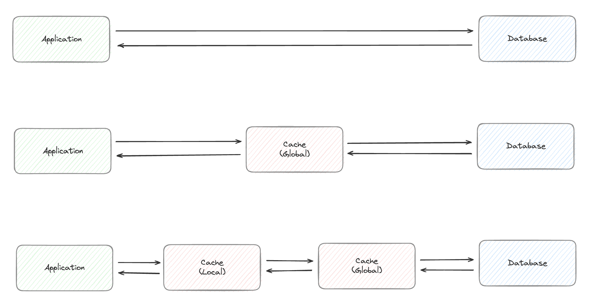

# Cache 더 활용해보기

## 1. Local Cache
### 활용


1. DB에 직접 요청하는 경우 지연 및 DB 부하가 집중된다
- 이로 인해서 캐시를 활용
- 여러 애플리케이션 간의 데이터 정합성 및 동기화를 위해 Global Cache 를 활용
  - Redis, Memcached 등 활용


2. Global Cache 를 활용하면 DB의 부하를 줄여주지만 다시 캐시 서버 부하가 발생할 수 있고, 네트워크 홉은 아직 존재한다
- 처리량을 더 증가시켜야 하는 경우 Local Cache 를 활용
  - Ehcache, Caffeine 등 활용
  - 일반 스프링부트 내장 캐시는 단순 ConcurrentHashMap을 활용, TTL 설정이 불가능하고 메모리 누수가 발생할 수 있음
- 데이터의 정합성 및 동기화를 위한 작업이 필요하지만 네트워크 홉이 줄어들어 성능 향상을 기대할 수 있음


3. 어떻게 Local Cache의 정합성 및 동기화를 관리할 것인가?
- 별도의 인프라를 구축하고 싶지 않다면, 데이터 변경 또는 글로벌 캐시 업데이트 시 Redis Pub/Sub을 통해 로컬 캐시를 무효화시켜줄 수 있다
  - Redis Pub/Sub의 경우 최대 연결 클라이언트 수가 10K이기 때문에 일반적인 캐싱 서비스에 이벤트 브로커로 활용했을 때 충분하다
- 혹은 Zookeeper 등의 서비스 디스커버리를 활용하여 캐시 서버의 상태를 관리하고, 캐시 무효화가 필요한 경우 디스커버리의 값을 변경하거나 트리거를 발생시켜 연결된 캐시 서버에 무효화를 작업을 요청할 수 있다


## 2. Hibernate Second Level Cache (+ Local Cache)
만약 수정이 잘 일어나지 않는 데이터라면 하이버네이트 캐시를 활용해보는 방법 고려
+ 세션 단위의 캐싱이 아닌 애플리케이션 단위의 캐싱을 활용해보는 것도 좋을 수 있음

<br>

> 예를 들어 자주 입력받는 상품이 정해져있고, 해당 정보를 여러 개 조회해서 정보를 조합해서 내려줘야 하는 경우


### Cache 적용이 없는 경우
아래와 같이 사용하는 경우 Entity 별 정보를 개별 엔티티에 대한 캐싱할 수 없음

```shell
interface ProductJpaRepository : JpaRepository<ProductEntity, Long> {
    fun findByIdIn(ids: Set<Long>): List<ProductEntity>
}
```

N번 조회 시 
```shell
[nio-8080-exec-5] org.hibernate.SQL                        : select pe1_0.id,pe1_0.bundle_name,pe1_0.bundle_quantity,pe1_0.description,pe1_0.name,pe1_0.price from products pe1_0 where pe1_0.id in (?,?,?,?,?)
[nio-8080-exec-6] org.hibernate.SQL                        : select pe1_0.id,pe1_0.bundle_name,pe1_0.bundle_quantity,pe1_0.description,pe1_0.name,pe1_0.price from products pe1_0 where pe1_0.id in (?,?,?,?,?)
[nio-8080-exec-4] org.hibernate.SQL                        : select pe1_0.id,pe1_0.bundle_name,pe1_0.bundle_quantity,pe1_0.description,pe1_0.name,pe1_0.price from products pe1_0 where pe1_0.id in (?,?,?,?,?)
[nio-8080-exec-9] org.hibernate.SQL                        : select pe1_0.id,pe1_0.bundle_name,pe1_0.bundle_quantity,pe1_0.description,pe1_0.name,pe1_0.price from products pe1_0 where pe1_0.id in (?,?,?,?,?)
[nio-8080-exec-3] org.hibernate.SQL                        : select pe1_0.id,pe1_0.bundle_name,pe1_0.bundle_quantity,pe1_0.description,pe1_0.name,pe1_0.price from products pe1_0 where pe1_0.id in (?,?,?,?,?)
```

### Cache 적용
종속성 추가
```groovy
implementation("org.ehcache:ehcache:3.10.8:jakarta")
implementation("org.hibernate.orm:hibernate-jcache:6.6.3.Final")
```

설정 추가 (ehcache 설정 추가)

```shell
...
spring:
  jpa:
    properties
      hibernate:
        cache:
          use_second_level_cache: true
          region.factory_class: org.hibernate.cache.jcache.internal.JCacheRegionFactory
          javax.cache.uri: ehcache.xml
          javax.cache.provider: org.ehcache.jsr107.EhcacheCachingProvider
```

Entity 캐싱 기능 추가

```kotlin
@Cacheable
class ProductEntity( ... )
```

Entity 별 캐싱 정보를 재활용

```kotlin
@Component
class ProductCustomRepositoryImpl(
    @PersistenceContext
    private val entityManager: EntityManager,
    private val jpaRepository: ProductJpaRepository,
) : ProductCustomRepository {

    override fun findByIds(ids: Set<Long>): List<ProductEntity> {
        if (ids.isEmpty()) {
            return emptyList()
        }

        val cache = entityManager.entityManagerFactory.cache
        val entities = mutableListOf<ProductEntity>()
        val nonCachingIds = mutableSetOf<Long>()

        for (id in ids) {
            if (cache.contains(ProductEntity::class.java, id)) {
                jpaRepository.findById(id).ifPresent { entities.add(it) }
            } else {
                nonCachingIds.add(id)
            }
        }

        if (nonCachingIds.isNotEmpty()) {
            entities.addAll(jpaRepository.findAllById(nonCachingIds))
        }

        return entities
    }
}
```

엔티티 캐싱으로 인해 조회하는 인자가 줄어들음
```shell
[nio-8080-exec-1] org.hibernate.SQL                        : select pe1_0.id,pe1_0.bundle_name,pe1_0.bundle_quantity,pe1_0.description,pe1_0.name,pe1_0.price from products pe1_0 where pe1_0.id in (?,?,?,?,?)
[nio-8080-exec-2] org.hibernate.SQL                        : select pe1_0.id,pe1_0.bundle_name,pe1_0.bundle_quantity,pe1_0.description,pe1_0.name,pe1_0.price from products pe1_0 where pe1_0.id in (?,?,?,?)
[nio-8080-exec-3] org.hibernate.SQL                        : select pe1_0.id,pe1_0.bundle_name,pe1_0.bundle_quantity,pe1_0.description,pe1_0.name,pe1_0.price from products pe1_0 where pe1_0.id in (?,?,?,?)
[nio-8080-exec-4] org.hibernate.SQL                        : select pe1_0.id,pe1_0.bundle_name,pe1_0.bundle_quantity,pe1_0.description,pe1_0.name,pe1_0.price from products pe1_0 where pe1_0.id in (?,?,?,?)
[nio-8080-exec-5] org.hibernate.SQL                        : select pe1_0.id,pe1_0.bundle_name,pe1_0.bundle_quantity,pe1_0.description,pe1_0.name,pe1_0.price from products pe1_0 where pe1_0.id in (?,?,?)
[nio-8080-exec-8] org.hibernate.SQL                        : select pe1_0.id,pe1_0.bundle_name,pe1_0.bundle_quantity,pe1_0.description,pe1_0.name,pe1_0.price from products pe1_0 where pe1_0.id in (?,?,?)
[nio-8080-exec-9] org.hibernate.SQL                        : select pe1_0.id,pe1_0.bundle_name,pe1_0.bundle_quantity,pe1_0.description,pe1_0.name,pe1_0.price from products pe1_0 where pe1_0.id in (?,?)
```
